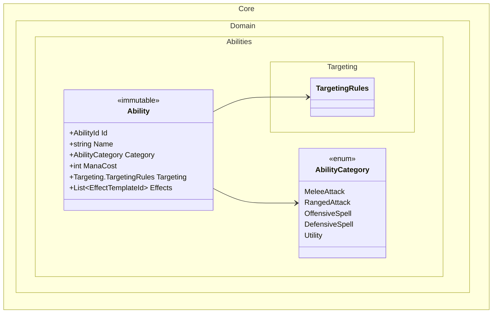

# Ability

```mermaid
classDiagram
direction LR

  %% ============================================================
  %% ABILITY 
  %% Abilities are immutable static content.
  %% Abilities have no instance version. They are used for targeting rules and
  %% to help resolve effect instances.
  %% ============================================================

  namespace Core.Domain.Abilities{
    class Ability {
      <<immutable>>
      +AbilityId Id
      +string Name
      +AbilityCategory Category
      +int ManaCost
      +Targeting.TargetingRules Targeting
      +List~EffectTemplateId~ Effects
    }

    class AbilityCategory {
      <<enum>>
      MeleeAttack
      RangedAttack
      OffensiveSpell
      DefensiveSpell
      Utility
    }
  }
  
  %% ------------------------------------------------------------
  %% Referenced Stubs
  %% ------------------------------------------------------------

  namespace Core.Domain.Abilities.Targeting{
    class TargetingRules
  }

  %% ------------------------------------------------------------
  %% Relationships
  %% ------------------------------------------------------------

  Ability --> AbilityCategory
  Ability --> TargetingRules
```
