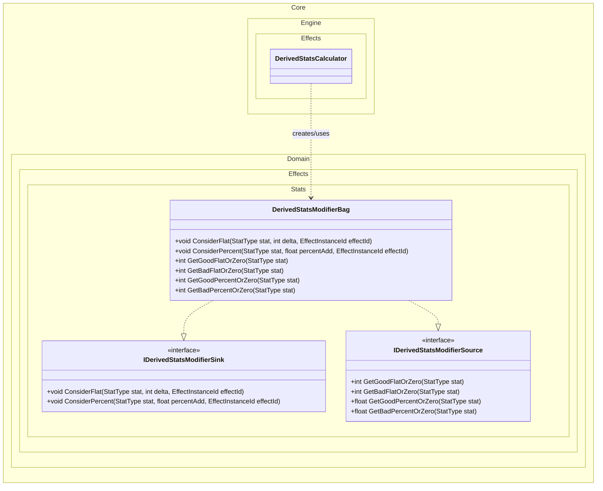

# DerivedStatsModifierBag

```mermaid
classDiagram
    direction LR


  %% ============================================================
  %% DERIVED STATS MODIFIER BAG
  %%
  %% Query-time dominance aggregator for DerivedStats recomputation
  %%
  %% Created per recomputation pass
  %% Written to by Effect component contributors
  %%
  %% Used by DerivedStatsCalculator to resolve final stat values
  %%
  %% Collects strongest buff and strongest debuff per StatType
  %% Separates flat deltas and percent-of-base deltas
  %%
  %% Buffs use MAX dominance
  %% Debuffs use MIN dominance
  %% Equal values resolved deterministically via EffectInstanceId
  %%
  %% Does not perform final stat math
  %% Does not mutate GameState
  %% ============================================================

  namespace Core.Domain.Effects.Stats{
    class DerivedStatsModifierBag{
      +void ConsiderFlat(StatType stat, int delta, EffectInstanceId effectId)
      +void ConsiderPercent(StatType stat, float percentAdd, EffectInstanceId effectId)

      +int GetGoodFlatOrZero(StatType stat)
      +int GetBadFlatOrZero(StatType stat)
      +int GetGoodPercentOrZero(StatType stat)
      +int GetBadPercentOrZero(StatType stat)
    }

    class IDerivedStatsModifierSink{
      <<interface>>
      +void ConsiderFlat(StatType stat, int delta, EffectInstanceId effectId)
      +void ConsiderPercent(StatType stat, float percentAdd, EffectInstanceId effectId)
    }

    class IDerivedStatsModifierSource{
      <<interface>>
      +int GetGoodFlatOrZero(StatType stat)
      +int GetBadFlatOrZero(StatType stat)
      +float GetGoodPercentOrZero(StatType stat)
      +float GetBadPercentOrZero(StatType stat)
    }
  }

  %% ------------------------------------------------------------
  %% Referenced Stubs
  %% ------------------------------------------------------------
  
  namespace Core.Engine.Effects{
    class DerivedStatsCalculator
  }

  %% ------------------------------------------------------------
  %% Relationships
  %% ------------------------------------------------------------

  DerivedStatsCalculator ..> DerivedStatsModifierBag : creates/uses

  DerivedStatsModifierBag ..|> IDerivedStatsModifierSink
  DerivedStatsModifierBag ..|> IDerivedStatsModifierSource


```
