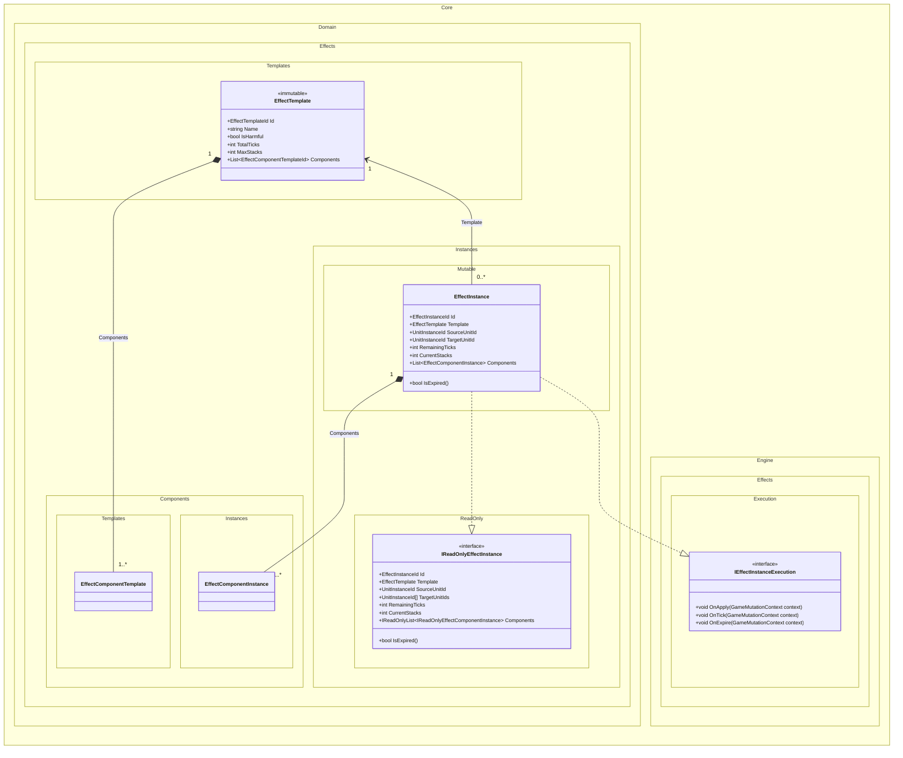

# Effect

```mermaid
%%{init: {'themeVariables': { 'fontSize': '10px' }}}%%
classDiagram
  direction LR

  %% ============================================================
  %% EFFECT TEMPLATE
  %% ============================================================

  namespace Core.Domain.Effects.Templates{
    class EffectTemplate {
      <<immutable>>
      +EffectTemplateId Id
      +string Name
      +bool IsHarmful
      +int TotalTicks
      +int MaxStacks
      +List~EffectComponentTemplateId~ Components
    }
  }

  namespace Core.Domain.Effects.Components.Templates{
    class EffectComponentTemplate
  }

  EffectTemplate "1" *-- "1..*" EffectComponentTemplate : Components

  %% ============================================================
  %% EFFECT INSTANCE
  %% ============================================================

  namespace Core.Domain.Effects.Instances.ReadOnly{
    class IReadOnlyEffectInstance {
      <<interface>>
      +EffectInstanceId Id
      +EffectTemplate Template
      +UnitInstanceId SourceUnitId
      +UnitInstanceId[] TargetUnitIds
      +int RemainingTicks
      +int CurrentStacks
      +IReadOnlyList~IReadOnlyEffectComponentInstance~ Components
      +bool IsExpired()
    }
  }

  %% Engine-only execution surface (capability interface)
  namespace Core.Engine.Effects.Execution{
    class IEffectInstanceExecution {
      <<interface>>
      +void OnApply(GameMutationContext context)
      +void OnTick(GameMutationContext context)
      +void OnExpire(GameMutationContext context)
    }
  }

  namespace Core.Domain.Effects.Instances.Mutable{
    class EffectInstance {
      +EffectInstanceId Id
      +EffectTemplate Template
      +UnitInstanceId SourceUnitId
      +UnitInstanceId TargetUnitId
      +int RemainingTicks
      +int CurrentStacks
      +List~EffectComponentInstance~ Components
      +bool IsExpired()
    }
  }

  %% ------------------------------------------------------------
  %% Referenced Stubs
  %% ------------------------------------------------------------

  namespace Core.Domain.Effects.Components.Instances{
    class EffectComponentInstance
  }
  %% ------------------------------------------------------------
  %% Relationships
  %% ------------------------------------------------------------
  
  %% Stored template ref
  EffectTemplate "1" <-- "0..*" EffectInstance : Template

  %% Interface implementations
  EffectInstance ..|> IReadOnlyEffectInstance
  EffectInstance ..|> IEffectInstanceExecution

  %% An effect instance can hold many effect component instances
  EffectInstance "1" *-- "1..*" EffectComponentInstance : Components

```
