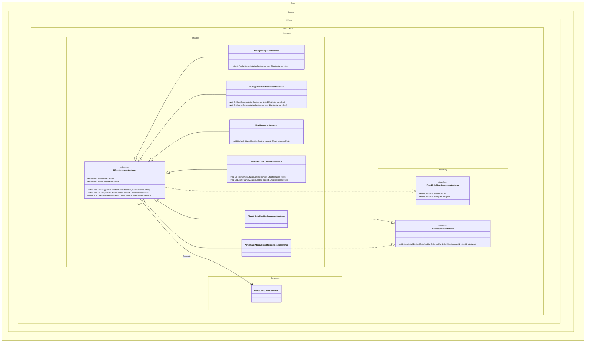

# EffectComponentInstance

```mermaid
%%{init: {'themeVariables': { 'fontSize': '8px' }}}%%

classDiagram
  direction LR

  %% ============================================================
  %% EFFECT COMPONENT INSTANCE
  %% ============================================================

  namespace Core.Domain.Effects.Components.Instances.ReadOnly{
    class IReadOnlyEffectComponentInstance {
      <<interface>>
      +EffectComponentInstanceId Id
      +EffectComponentTemplate Template
    }
  }

  namespace Core.Domain.Effects.Components.Instances.Mutable{
    class EffectComponentInstance {
      <<abstract>>
      +EffectComponentInstanceId Id
      +EffectComponentTemplate Template

      +virtual void OnApply(GameMutationContext context, EffectInstance effect)
      +virtual void OnTick(GameMutationContext context, EffectInstance effect)
      +virtual void OnExpire(GameMutationContext context, EffectInstance effect)
    }

    class DamageComponentInstance{
      +void OnApply(GameMutationContext context, EffectInstance effect)
    }

    class DamageOverTimeComponentInstance{
      +void OnTick(GameMutationContext context, EffectInstance effect)
      +void OnExpire(GameMutationContext context, EffectInstance effect)
    }

    class HealComponentInstance{
      +void OnApply(GameMutationContext context, EffectInstance effect)
    }

    class HealOverTimeComponentInstance{
      +void OnTick(GameMutationContext context, EffectInstance effect)
      +void OnExpire(GameMutationContext context, EffectInstance effect)
    }

    class FlatAttributeModifierComponentInstance{
    }
    class PercentageAttributeModifierComponentInstance{
    }
  }

  %% ----------------------------
  %% Capability interfaces
  %% ----------------------------

  namespace Core.Domain.Effects.Components.Instances.ReadOnly{
    class IDerivedStatsContributor{
      <<interface>>
      +void Contribute(IDerivedStatsModifierSink modifierSink, EffectInstanceId effectId, int stacks)
    }
  }

  %% ------------------------------------------------------------
  %% Referenced Stubs
  %% ------------------------------------------------------------

  namespace Core.Domain.Effects.Components.Templates{
    class EffectComponentTemplate
  }

  %% ------------------------------------------------------------
  %% Relationships
  %% ------------------------------------------------------------
  
  EffectComponentInstance <|-- DamageComponentInstance
  EffectComponentInstance <|-- DamageOverTimeComponentInstance
  EffectComponentInstance <|-- HealComponentInstance
  EffectComponentInstance <|-- HealOverTimeComponentInstance
  EffectComponentInstance <|-- FlatAttributeModifierComponentInstance
  EffectComponentInstance <|-- PercentageAttributeModifierComponentInstance
  EffectComponentInstance ..|> IReadOnlyEffectComponentInstance

  %% Derived-stats contributors (data-only modifiers)
  FlatAttributeModifierComponentInstance ..|> IDerivedStatsContributor
  PercentageAttributeModifierComponentInstance ..|> IDerivedStatsContributor

  EffectComponentInstance "0..*" --> "1" EffectComponentTemplate : Template

```
