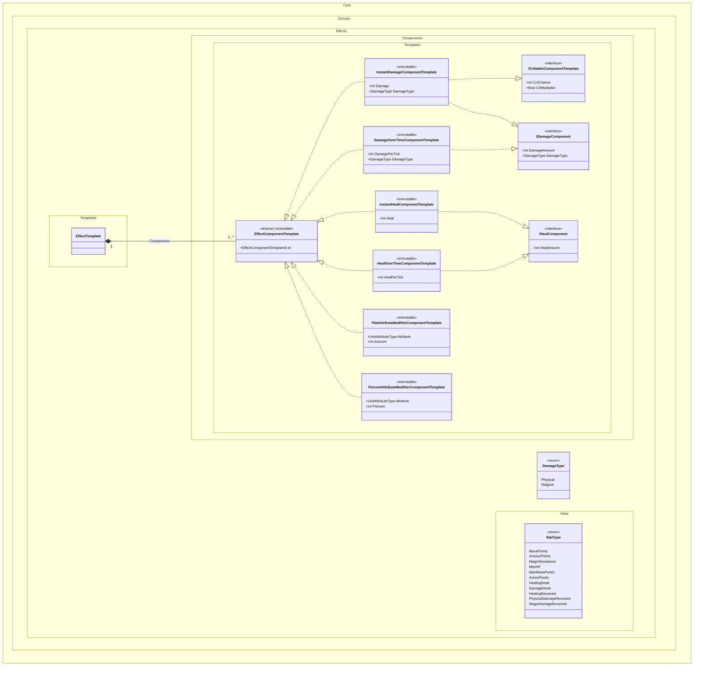

# EffectComponentTemplate

```mermaid
%%{init: {'themeVariables': { 'fontSize': '10px' }}}%%

classDiagram
  direction LR

  %% ============================================================
  %% EFFECT COMPONENT TEMPLATES
  %% ============================================================

  namespace Core.Domain.Effects.Components.Templates{
    class EffectComponentTemplate {
      <<abstract immutable>>
      +EffectComponentTemplateId Id
    }

    %% ----------------------------
    %% Capability interfaces
    %% ----------------------------

    class IDamageComponent {
      <<interface>>
      +int DamageAmount
      +DamageType DamageType
    }

    class IHealComponent {
      <<interface>>
      +int HealAmount
    }

    class ICrittableComponentTemplate {
      <<interface>>
      +int CritChance
      +float CritMultiplier
    }

    %% ----------------------------
    %% Concrete templates
    %% ----------------------------

    class InstantDamageComponentTemplate {
      <<immutable>>
      +int Damage
      +DamageType DamageType
    }

    class DamageOverTimeComponentTemplate {
      <<immutable>>
      +int DamagePerTick
      +DamageType DamageType
    }

    class InstantHealComponentTemplate {
      <<immutable>>
      +int Heal
    }

    class HealOverTimeComponentTemplate {
      <<immutable>>
      +int HealPerTick
    }

    class FlatAttributeModifierComponentTemplate {
      <<immutable>>
      +UnitAttributeType Attribute
      +int Amount
    }

    class PercentAttributeModifierComponentTemplate {
      <<immutable>>
      +UnitAttributeType Attribute
      +int Percent
    }
  }

  namespace Core.Domain.Effects.Stats{
    class StatType {
      <<enum>>
      MovePoints
      ArmourPoints
      MagicResistance
      MaxHP
      MaxManaPoints
      ActionPoints
      HealingDealt
      DamageDealt
      HealingReceived
      PhysicalDamageReceived
      MagicDamageReceived
    }
  }
  namespace Core.Domain.Effects{
    class DamageType {
      <<enum>>
      Physical
      Magical
    }
  }

  %% ------------------------------------------------------------
  %% Referenced Stubs
  %% ------------------------------------------------------------

  namespace Core.Domain.Effects.Templates{
    class EffectTemplate
  }

  %% ------------------------------------------------------------
  %% Relationships
  %% ------------------------------------------------------------

  %% Stored template ref
  EffectTemplate "1" *-- "1..*" EffectComponentTemplate : Components

  %% Abstract implementations
  EffectComponentTemplate <|.. InstantDamageComponentTemplate
  EffectComponentTemplate <|.. DamageOverTimeComponentTemplate
  EffectComponentTemplate <|.. InstantHealComponentTemplate
  EffectComponentTemplate <|.. HealOverTimeComponentTemplate
  EffectComponentTemplate <|.. FlatAttributeModifierComponentTemplate
  EffectComponentTemplate <|.. PercentAttributeModifierComponentTemplate

  %% Interface implementations 
  InstantDamageComponentTemplate ..|> ICrittableComponentTemplate
  InstantDamageComponentTemplate ..|> IDamageComponent
  DamageOverTimeComponentTemplate ..|> IDamageComponent

  InstantHealComponentTemplate ..|> IHealComponent
  HealOverTimeComponentTemplate ..|> IHealComponent


```
