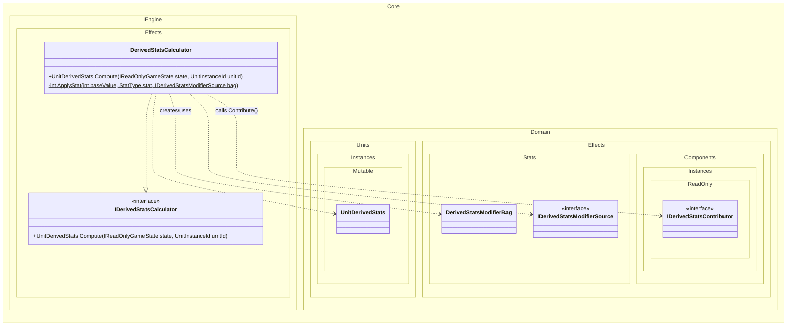

# DerrivedStatsCalculator

```mermaid
classDiagram
  direction LR

  %% ============================================================
  %% DERIVED STATS CALCULATOR
  %%
  %% Stateless recomputation service for UnitDerivedStats
  %%
  %% Invoked when derived stats must be resolved for a unit
  %% Operates purely on IReadOnlyGameState
  %%
  %% Produces a new UnitDerivedStats snapshot based on current Contributors
  %%
  %% Does not mutate GameState directly
  %% Does not persist intermediate state
  %% Allocates a temporary DerivedStatsModifierBag per computation
  %% ============================================================

  namespace Core.Engine.Effects{
    class IDerivedStatsCalculator{
      <<interface>>
      +UnitDerivedStats Compute(IReadOnlyGameState state, UnitInstanceId unitId)
    }

    class DerivedStatsCalculator{
      +UnitDerivedStats Compute(IReadOnlyGameState state, UnitInstanceId unitId)
      -int ApplyStat(int baseValue, StatType stat, IDerivedStatsModifierSource bag)$
    }
  }

  %% ------------------------------------------------------------
  %% Referenced Stubs
  %% ------------------------------------------------------------

  namespace Core.Domain.Units.Instances.Mutable{
    class UnitDerivedStats
  }

  namespace Core.Domain.Effects.Stats{
    class DerivedStatsModifierBag
    class IDerivedStatsModifierSource{
        <<interface>>
    }
  }

  namespace Core.Domain.Effects.Components.Instances.ReadOnly{
    class IDerivedStatsContributor{
        <<interface>>
    }
  }
  %% ------------------------------------------------------------
  %% Relationships
  %% ------------------------------------------------------------
  
  DerivedStatsCalculator ..|> IDerivedStatsCalculator

  DerivedStatsCalculator ..> UnitDerivedStats 

  DerivedStatsCalculator ..> DerivedStatsModifierBag : creates/uses
  DerivedStatsCalculator ..> IDerivedStatsModifierSource

  DerivedStatsCalculator ..> IDerivedStatsContributor : calls Contribute()
```
