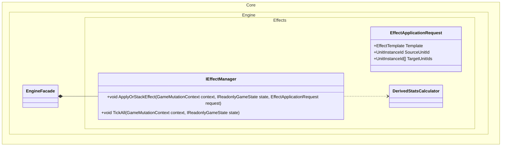

# EffectManager

```mermaid
classDiagram
  direction LR

  %% ============================================================
  %% EFFECT MANAGER
  %%
  %% Central orchestration service for applying, stacking,
  %% ticking, and resolving effect instances on units
  %%
  %% Entry point for effect lifecycle execution
  %% Operates within a GameMutationContext
  %% Reads from IReadOnlyGameState
  %%
  %% Does not directly modify GameState structures
  %% Performs mutations only through provided mutators
  %% ============================================================
  namespace Core.Engine.Effects{
    class EffectApplicationRequest{
      +EffectTemplate Template
      +UnitInstanceId SourceUnitId
      +UnitInstanceId[] TargetUnitIds
    }

    class IEffectManager{
      +void ApplyOrStackEffect(GameMutationContext context, IReadonlyGameState state, EffectApplicationRequest request)
      +void TickAll(GameMutationContext context, IReadonlyGameState state)
    }
  }

  %% ------------------------------------------------------------
  %% Referenced Stubs
  %% ------------------------------------------------------------
  namespace Core.Engine{
    class EngineFacade
  }

  namespace Core.Engine.Effects{
    class DerivedStatsCalculator
  }

  %% ------------------------------------------------------------
  %% Relationships
  %% ------------------------------------------------------------
  
  %% Owned by engine facade
  EngineFacade *-- IEffectManager

  %% EffectManager orchestrates recompute
  IEffectManager ..> DerivedStatsCalculator


```
