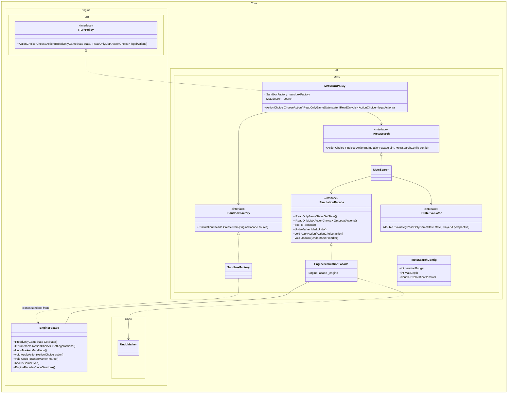

# MctsTurnPolicy

```mermaid
classDiagram
direction LR

namespace Core.Engine {
  class EngineFacade {
    +IReadOnlyGameState GetState()
    +IEnumerable~ActionChoice~ GetLegalActions()
    +UndoMarker MarkUndo()
    +void ApplyAction(ActionChoice action)
    +void UndoTo(UndoMarker marker)
    +bool IsGameOver()
    +EngineFacade CloneSandbox()
  }
}

namespace Core.Engine.Undo {
  class UndoMarker
}

namespace Core.Engine.Turn {
  class ITurnPolicy {
    <<interface>>
    +ActionChoice ChooseAction(IReadOnlyGameState state, IReadOnlyList~ActionChoice~ legalActions)
  }
}

namespace Core.AI.Mcts {
  class MctsTurnPolicy {
    -ISandboxFactory _sandboxFactory
    -IMctsSearch _search
    +ActionChoice ChooseAction(IReadOnlyGameState state, IReadOnlyList~ActionChoice~ legalActions)
  }

  class IMctsSearch {
    <<interface>>
    +ActionChoice FindBestAction(ISimulationFacade sim, MctsSearchConfig config)
  }

  class MctsSearch

  class ISimulationFacade {
    <<interface>>
    +IReadOnlyGameState GetState()
    +IReadOnlyList~ActionChoice~ GetLegalActions()
    +bool IsTerminal()
    +UndoMarker MarkUndo()
    +void ApplyAction(ActionChoice action)
    +void UndoTo(UndoMarker marker)
  }

  class EngineSimulationFacade {
    -EngineFacade _engine
  }

  class ISandboxFactory {
    <<interface>>
    +ISimulationFacade CreateFrom(EngineFacade source)
  }

  class SandboxFactory

  class IStateEvaluator {
    <<interface>>
    +double Evaluate(IReadOnlyGameState state, PlayerId perspective)
  }

  class MctsSearchConfig {
    +int IterationBudget
    +int MaxDepth
    +double ExplorationConstant
  }
}

ITurnPolicy <|.. MctsTurnPolicy
IMctsSearch <|.. MctsSearch
ISimulationFacade <|.. EngineSimulationFacade
ISandboxFactory <|.. SandboxFactory

MctsTurnPolicy --> ISandboxFactory
MctsTurnPolicy --> IMctsSearch
MctsSearch --> ISimulationFacade
MctsSearch --> IStateEvaluator
EngineSimulationFacade o-- EngineFacade
EngineSimulationFacade ..> UndoMarker
SandboxFactory ..> EngineFacade : clones sandbox from
```
