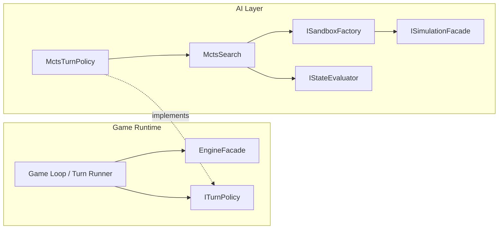

# Overview

```mermaid
flowchart LR
  subgraph Game["Game Runtime"]
    GameLoop["Game Loop / Turn Runner"]
    Engine["EngineFacade"]
    Policy["ITurnPolicy"]
  end

  subgraph AI["AI Layer"]
    Mcts["MctsTurnPolicy"]
    Search["MctsSearch"]
    SimFactory["ISandboxFactory"]
    Sim["ISimulationFacade"]
    Eval["IStateEvaluator"]
  end

  GameLoop --> Policy
  GameLoop --> Engine

  Mcts -.implements.-> Policy
  Mcts --> Search
  Search --> SimFactory
  Search --> Eval
  SimFactory --> Sim
```
