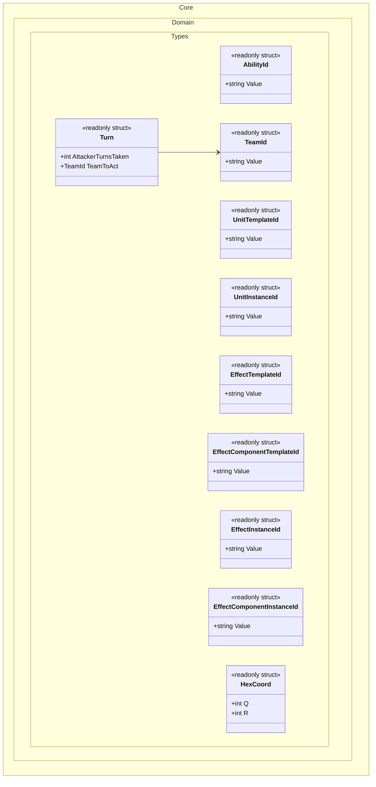

# ValueTypes

```mermaid
classDiagram
  direction LR

  %% ============================================================
  %% DOMAIN VALUE TYPES
  %% Strongly-typed IDs and lightweight runtime value objects.
  %% ============================================================

  namespace Core.Domain.Types {
    %% Major Class: AbilityId
    class AbilityId {
      <<readonly struct>>
      +string Value
    }

    %% Major Class: UnitTemplateId
    class UnitTemplateId {
      <<readonly struct>>
      +string Value
    }

    %% Major Class: UnitInstanceId
    class UnitInstanceId {
      <<readonly struct>>
      +string Value
    }

    %% Major Class: EffectTemplateId
    class EffectTemplateId {
      <<readonly struct>>
      +string Value
    }

    %% Major Class: EffectComponentTemplateId
    class EffectComponentTemplateId {
      <<readonly struct>>
      +string Value
    }

    %% Major Class: EffectInstanceId
    class EffectInstanceId {
      <<readonly struct>>
      +string Value
    }

    %% Major Class: EffectComponentInstanceId
    class EffectComponentInstanceId {
      <<readonly struct>>
      +string Value
    }

    %% Major Class: TeamId
    class TeamId {
      <<readonly struct>>
      +string Value
    }

    %% Major Class: HexCoord
    class HexCoord {
      <<readonly struct>>
      +int Q
      +int R
    }

    %% Major Class: Turn
    class Turn {
      <<readonly struct>>
      +int AttackerTurnsTaken
      +TeamId TeamToAct
    }
  }

  Turn --> TeamId

```
