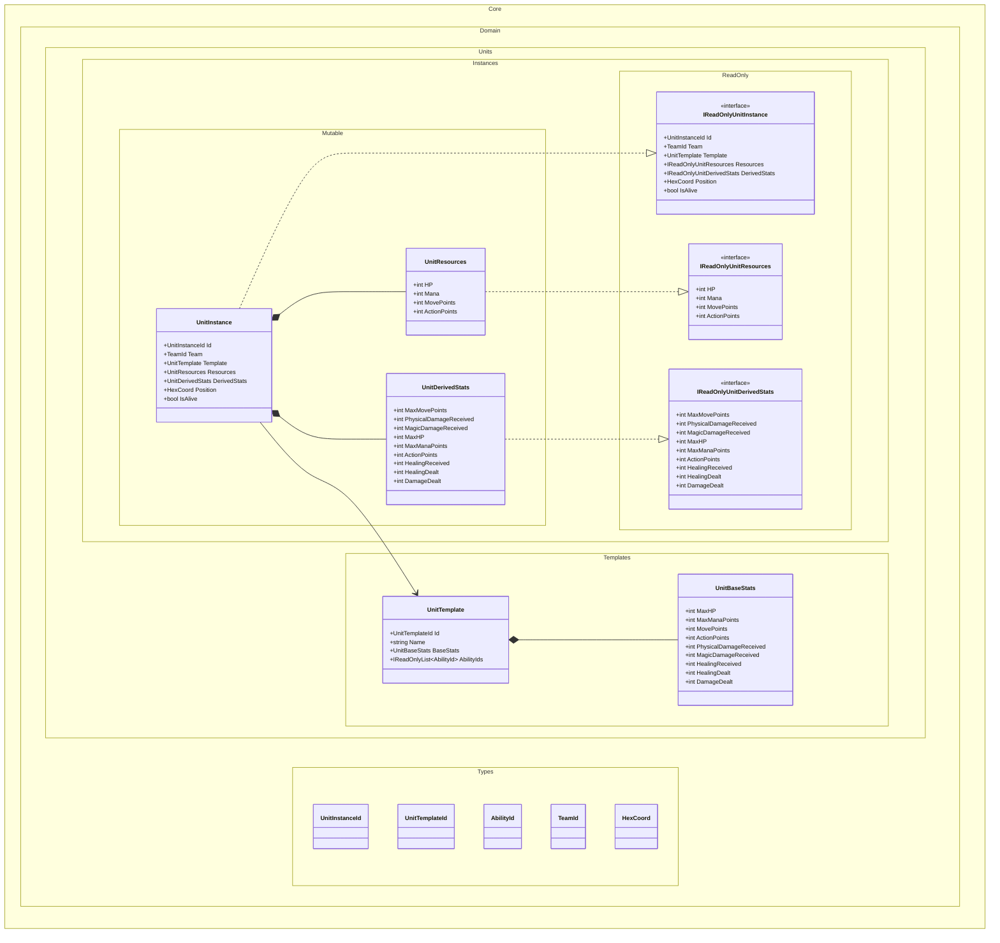

# Unit

```mermaid
%%{init: {'themeVariables': { 'fontSize': '10px' }}}%%
classDiagram
  direction LR

  %% ============================================================
  %% UNITS DOMAIN
  %% Defines runtime unit state and immutable unit template data.
  %% ============================================================

  namespace Core.Domain.Units.Instances.ReadOnly {
    class IReadOnlyUnitInstance {
      <<interface>>
      +UnitInstanceId Id
      +TeamId Team
      +UnitTemplate Template
      +IReadOnlyUnitResources Resources
      +IReadOnlyUnitDerivedStats DerivedStats
      +HexCoord Position
      +bool IsAlive
    }

    class IReadOnlyUnitResources {
      <<interface>>
      +int HP
      +int Mana
      +int MovePoints
      +int ActionPoints
    }

    class IReadOnlyUnitDerivedStats {
      <<interface>>
      +int MaxMovePoints
      +int PhysicalDamageReceived
      +int MagicDamageReceived
      +int MaxHP
      +int MaxManaPoints
      +int ActionPoints
      +int HealingReceived
      +int HealingDealt
      +int DamageDealt
    }
  }

  namespace Core.Domain.Units.Instances.Mutable {
    class UnitInstance {
      +UnitInstanceId Id
      +TeamId Team
      +UnitTemplate Template
      +UnitResources Resources
      +UnitDerivedStats DerivedStats
      +HexCoord Position
      +bool IsAlive
    }

    class UnitResources {
      +int HP
      +int Mana
      +int MovePoints
      +int ActionPoints
    }

    class UnitDerivedStats {
      +int MaxMovePoints
      +int PhysicalDamageReceived
      +int MagicDamageReceived
      +int MaxHP
      +int MaxManaPoints
      +int ActionPoints
      +int HealingReceived
      +int HealingDealt
      +int DamageDealt
    }
  }

  namespace Core.Domain.Units.Templates {
    class UnitTemplate {
      +UnitTemplateId Id
      +string Name
      +UnitBaseStats BaseStats
      +IReadOnlyList~AbilityId~ AbilityIds
    }

    class UnitBaseStats {
      +int MaxHP
      +int MaxManaPoints
      +int MovePoints
      +int ActionPoints
      +int PhysicalDamageReceived
      +int MagicDamageReceived
      +int HealingReceived
      +int HealingDealt
      +int DamageDealt
    }
  }

  namespace Core.Domain.Types {
    class UnitInstanceId
    class UnitTemplateId
    class AbilityId
    class TeamId
    class HexCoord
  }

  UnitInstance ..|> IReadOnlyUnitInstance
  UnitResources ..|> IReadOnlyUnitResources
  UnitDerivedStats ..|> IReadOnlyUnitDerivedStats

  UnitInstance *-- UnitResources
  UnitInstance *-- UnitDerivedStats
  UnitInstance --> UnitTemplate

  UnitTemplate *-- UnitBaseStats

```
