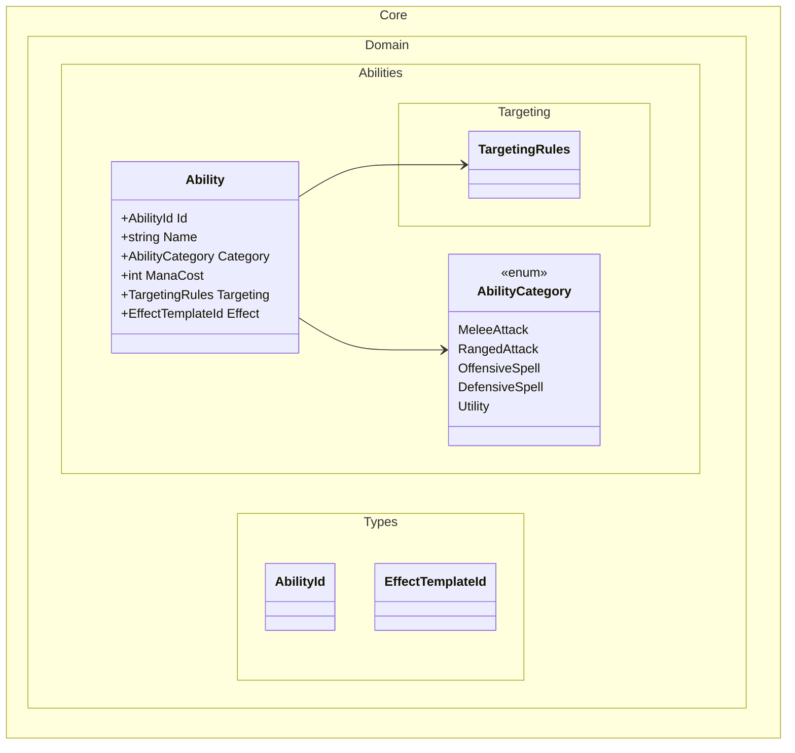

# Ability

```mermaid
classDiagram
  direction LR

  %% ============================================================
  %% ABILITY
  %% Defines immutable ability metadata and links to targeting/effects.
  %% ============================================================

  %% ------------------------------------------------------------
  %% Primary Types
  %% ------------------------------------------------------------
  namespace Core.Domain.Abilities {
    %% Major Class: Ability
    %% Immutable ability definition used by execution and validation.
    class Ability {
      +AbilityId Id
      +string Name
      +AbilityCategory Category
      +int ManaCost
      +TargetingRules Targeting
      +EffectTemplateId Effect
    }

    %% Major Class: AbilityCategory
    %% High-level ability taxonomy.
    class AbilityCategory {
      <<enum>>
      MeleeAttack
      RangedAttack
      OffensiveSpell
      DefensiveSpell
      Utility
    }
  }

  %% ------------------------------------------------------------
  %% Referenced Stubs
  %% ------------------------------------------------------------
  namespace Core.Domain.Abilities.Targeting {
    class TargetingRules
  }

  namespace Core.Domain.Types {
    class AbilityId
    class EffectTemplateId
  }

  %% ------------------------------------------------------------
  %% Relationships
  %% ------------------------------------------------------------
  Ability --> AbilityCategory
  Ability --> TargetingRules

```
