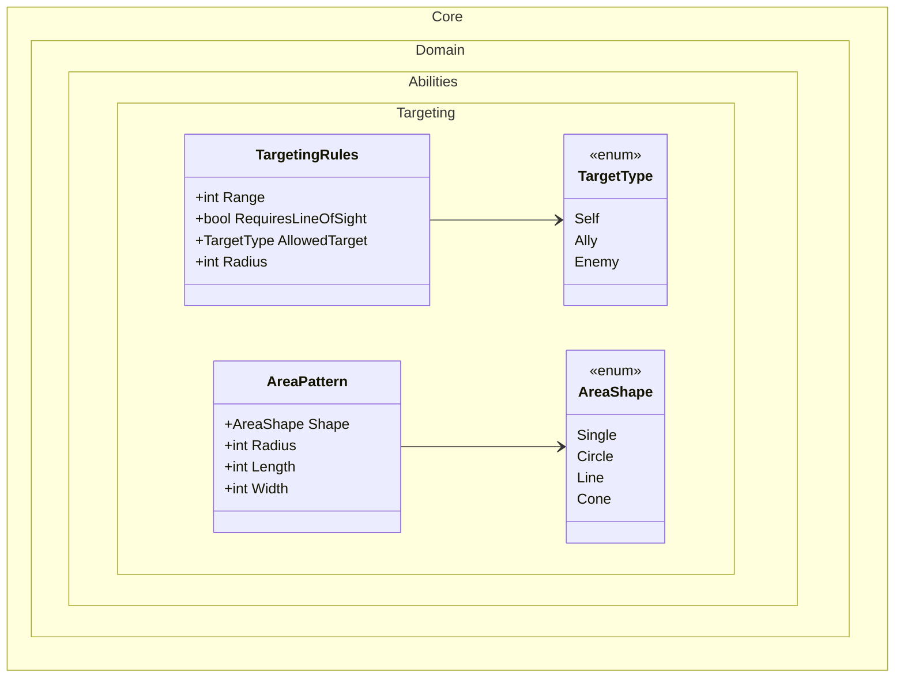

# TargetingRules

```mermaid
classDiagram
  direction LR

  %% ============================================================
  %% TARGETING RULES
  %% Defines target constraints and area selection parameters.
  %% ============================================================

  %% ------------------------------------------------------------
  %% Primary Types
  %% ------------------------------------------------------------
  namespace Core.Domain.Abilities.Targeting {
    %% Major Class: TargetingRules
    %% Immutable targeting contract attached to an ability.
    class TargetingRules {
      +int Range
      +bool RequiresLineOfSight
      +TargetType AllowedTarget
      +int Radius
    }

    %% Major Class: TargetType
    %% Allowed relation between caster and target.
    class TargetType {
      <<enum>>
      Self
      Ally
      Enemy
    }

    %% Major Class: AreaPattern
    %% Optional richer area geometry descriptor used by future systems.
    class AreaPattern {
      +AreaShape Shape
      +int Radius
      +int Length
      +int Width
    }

    %% Major Class: AreaShape
    %% Geometric strategy for area selection.
    class AreaShape {
      <<enum>>
      Single
      Circle
      Line
      Cone
    }
  }

  %% ------------------------------------------------------------
  %% Relationships
  %% ------------------------------------------------------------
  TargetingRules --> TargetType
  AreaPattern --> AreaShape

```
