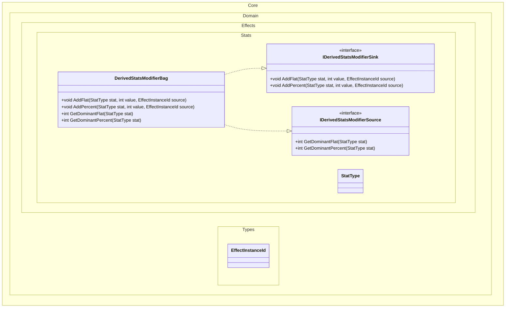

# DerivedStatsModifierBag

```mermaid
classDiagram
  direction LR

  %% ============================================================
  %% DERIVED STATS MODIFIER BAG
  %% Aggregates dominant buffs/debuffs per stat during recomputation.
  %% ============================================================

  namespace Core.Domain.Effects.Stats {
    %% Major Class: IDerivedStatsModifierSink
    class IDerivedStatsModifierSink {
      <<interface>>
      +void AddFlat(StatType stat, int value, EffectInstanceId source)
      +void AddPercent(StatType stat, int value, EffectInstanceId source)
    }

    %% Major Class: IDerivedStatsModifierSource
    class IDerivedStatsModifierSource {
      <<interface>>
      +int GetDominantFlat(StatType stat)
      +int GetDominantPercent(StatType stat)
    }

    %% Major Class: DerivedStatsModifierBag
    class DerivedStatsModifierBag {
      +void AddFlat(StatType stat, int value, EffectInstanceId source)
      +void AddPercent(StatType stat, int value, EffectInstanceId source)
      +int GetDominantFlat(StatType stat)
      +int GetDominantPercent(StatType stat)
    }

    class StatType
  }

  namespace Core.Domain.Types {
    class EffectInstanceId
  }

  DerivedStatsModifierBag ..|> IDerivedStatsModifierSink
  DerivedStatsModifierBag ..|> IDerivedStatsModifierSource

```
