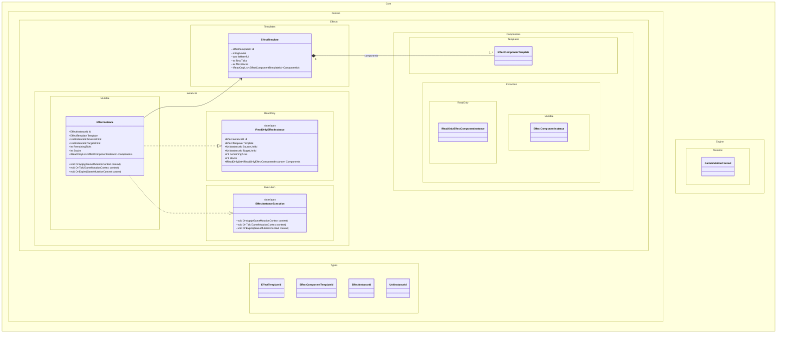

# Effect

```mermaid
%%{init: {'themeVariables': { 'fontSize': '10px' }}}%%
classDiagram
  direction LR

  %% ============================================================
  %% EFFECTS
  %% Defines immutable effect templates and runtime effect instances.
  %% ============================================================

  namespace Core.Domain.Effects.Templates {
    %% Major Class: EffectTemplate
    class EffectTemplate {
      +EffectTemplateId Id
      +string Name
      +bool IsHarmful
      +int TotalTicks
      +int MaxStacks
      +IReadOnlyList~EffectComponentTemplateId~ ComponentIds
    }
  }

  namespace Core.Domain.Effects.Instances.ReadOnly {
    %% Major Class: IReadOnlyEffectInstance
    class IReadOnlyEffectInstance {
      <<interface>>
      +EffectInstanceId Id
      +EffectTemplate Template
      +UnitInstanceId SourceUnitId
      +UnitInstanceId TargetUnitId
      +int RemainingTicks
      +int Stacks
      +IReadOnlyList~IReadOnlyEffectComponentInstance~ Components
    }
  }

  namespace Core.Domain.Effects.Instances.Execution {
    %% Major Class: IEffectInstanceExecution
    class IEffectInstanceExecution {
      <<interface>>
      +void OnApply(GameMutationContext context)
      +void OnTick(GameMutationContext context)
      +void OnExpire(GameMutationContext context)
    }
  }

  namespace Core.Domain.Effects.Instances.Mutable {
    %% Major Class: EffectInstance
    class EffectInstance {
      +EffectInstanceId Id
      +EffectTemplate Template
      +UnitInstanceId SourceUnitId
      +UnitInstanceId TargetUnitId
      +int RemainingTicks
      +int Stacks
      +IReadOnlyList~EffectComponentInstance~ Components
      +void OnApply(GameMutationContext context)
      +void OnTick(GameMutationContext context)
      +void OnExpire(GameMutationContext context)
    }
  }

  namespace Core.Domain.Effects.Components.Templates {
    class EffectComponentTemplate
  }

  namespace Core.Domain.Effects.Components.Instances.ReadOnly {
    class IReadOnlyEffectComponentInstance
  }

  namespace Core.Domain.Effects.Components.Instances.Mutable {
    class EffectComponentInstance
  }

  namespace Core.Engine.Mutation {
    class GameMutationContext
  }

  namespace Core.Domain.Types {
    class EffectTemplateId
    class EffectComponentTemplateId
    class EffectInstanceId
    class UnitInstanceId
  }

  EffectTemplate "1" *-- "1..*" EffectComponentTemplate : components
  EffectInstance ..|> IReadOnlyEffectInstance
  EffectInstance ..|> IEffectInstanceExecution
  EffectInstance --> EffectTemplate

```
