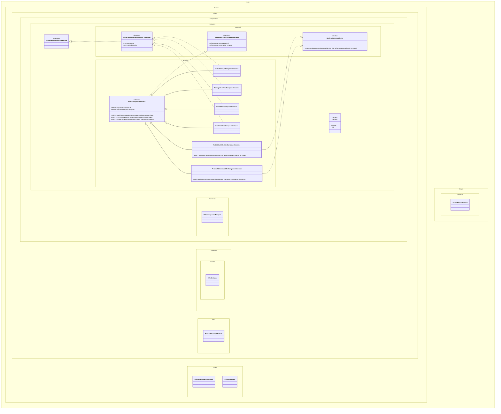

# EffectComponentInstance

```mermaid
%%{init: {'themeVariables': { 'fontSize': '9px' }}}%%
classDiagram
  direction LR

  %% ============================================================
  %% EFFECT COMPONENT INSTANCES
  %% Runtime component hierarchy and read-only contracts.
  %% ============================================================

  namespace Core.Domain.Effects.Components.Instances.ReadOnly {
    class IReadOnlyEffectComponentInstance {
      <<interface>>
      +EffectComponentInstanceId Id
      +EffectComponentTemplate Template
    }

    class IReadOnlyResolvableHpDeltaComponent {
      <<interface>>
      +HpType HpType
      +int ResolvedHpDelta
    }

    class IDerivedStatsContributor {
      <<interface>>
      +void Contribute(IDerivedStatsModifierSink sink, EffectInstanceId effectId, int stacks)
    }
  }

  namespace Core.Domain.Effects.Components.Instances.Mutable {
    class EffectComponentInstance {
      <<abstract>>
      +EffectComponentInstanceId Id
      +EffectComponentTemplate Template
      +void OnApply(GameMutationContext context, EffectInstance effect)
      +void OnTick(GameMutationContext context, EffectInstance effect)
      +void OnExpire(GameMutationContext context, EffectInstance effect)
    }

    class InstantDamageComponentInstance
    class DamageOverTimeComponentInstance
    class InstantHealComponentInstance
    class HealOverTimeComponentInstance
    class FlatAttributeModifierComponentInstance {
      +void Contribute(IDerivedStatsModifierSink sink, EffectInstanceId effectId, int stacks)
    }

    class PercentAttributeModifierComponentInstance {
      +void Contribute(IDerivedStatsModifierSink sink, EffectInstanceId effectId, int stacks)
    }
  }

  namespace Core.Domain.Effects.Components.Instances {
    class IResolvableHpDeltaComponent {
      <<interface>>
    }

    class HpType {
      <<enum>>
      Damage
      Heal
    }
  }

  namespace Core.Domain.Effects.Components.Templates {
    class EffectComponentTemplate
  }

  namespace Core.Domain.Effects.Instances.Mutable {
    class EffectInstance
  }

  namespace Core.Domain.Effects.Stats {
    class IDerivedStatsModifierSink
  }

  namespace Core.Engine.Mutation {
    class GameMutationContext
  }

  namespace Core.Domain.Types {
    class EffectComponentInstanceId
    class EffectInstanceId
  }

  EffectComponentInstance ..|> IReadOnlyEffectComponentInstance

  EffectComponentInstance <|-- InstantDamageComponentInstance
  EffectComponentInstance <|-- DamageOverTimeComponentInstance
  EffectComponentInstance <|-- InstantHealComponentInstance
  EffectComponentInstance <|-- HealOverTimeComponentInstance
  EffectComponentInstance <|-- FlatAttributeModifierComponentInstance
  EffectComponentInstance <|-- PercentAttributeModifierComponentInstance

  IResolvableHpDeltaComponent <|.. IReadOnlyResolvableHpDeltaComponent
  IReadOnlyResolvableHpDeltaComponent <|.. InstantDamageComponentInstance
  IReadOnlyResolvableHpDeltaComponent <|.. DamageOverTimeComponentInstance
  IReadOnlyResolvableHpDeltaComponent <|.. InstantHealComponentInstance
  IReadOnlyResolvableHpDeltaComponent <|.. HealOverTimeComponentInstance

  FlatAttributeModifierComponentInstance ..|> IDerivedStatsContributor
  PercentAttributeModifierComponentInstance ..|> IDerivedStatsContributor

```
