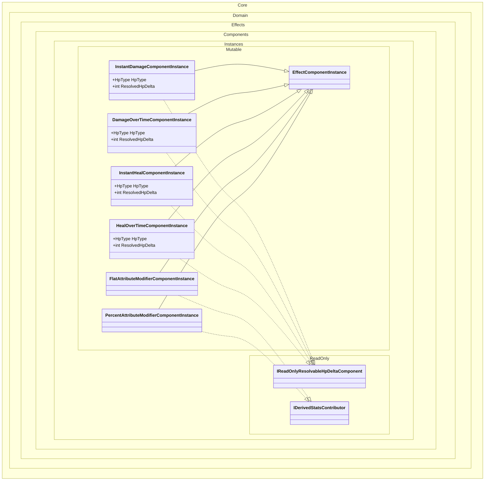

# EffectComponentInstanceConcrete

```mermaid
classDiagram
  direction LR

  %% ============================================================
  %% CONCRETE EFFECT COMPONENT INSTANCES
  %% Runtime component subclasses used in active effects.
  %% ============================================================

  namespace Core.Domain.Effects.Components.Instances.Mutable {
    %% Major Class: InstantDamageComponentInstance
    class InstantDamageComponentInstance {
      +HpType HpType
      +int ResolvedHpDelta
    }

    %% Major Class: DamageOverTimeComponentInstance
    class DamageOverTimeComponentInstance {
      +HpType HpType
      +int ResolvedHpDelta
    }

    %% Major Class: InstantHealComponentInstance
    class InstantHealComponentInstance {
      +HpType HpType
      +int ResolvedHpDelta
    }

    %% Major Class: HealOverTimeComponentInstance
    class HealOverTimeComponentInstance {
      +HpType HpType
      +int ResolvedHpDelta
    }

    %% Major Class: FlatAttributeModifierComponentInstance
    class FlatAttributeModifierComponentInstance

    %% Major Class: PercentAttributeModifierComponentInstance
    class PercentAttributeModifierComponentInstance
  }

  namespace Core.Domain.Effects.Components.Instances.Mutable {
    class EffectComponentInstance
  }

  namespace Core.Domain.Effects.Components.Instances.ReadOnly {
    class IReadOnlyResolvableHpDeltaComponent
    class IDerivedStatsContributor
  }

  InstantDamageComponentInstance --|> EffectComponentInstance
  DamageOverTimeComponentInstance --|> EffectComponentInstance
  InstantHealComponentInstance --|> EffectComponentInstance
  HealOverTimeComponentInstance --|> EffectComponentInstance
  FlatAttributeModifierComponentInstance --|> EffectComponentInstance
  PercentAttributeModifierComponentInstance --|> EffectComponentInstance

  InstantDamageComponentInstance ..|> IReadOnlyResolvableHpDeltaComponent
  DamageOverTimeComponentInstance ..|> IReadOnlyResolvableHpDeltaComponent
  InstantHealComponentInstance ..|> IReadOnlyResolvableHpDeltaComponent
  HealOverTimeComponentInstance ..|> IReadOnlyResolvableHpDeltaComponent
  FlatAttributeModifierComponentInstance ..|> IDerivedStatsContributor
  PercentAttributeModifierComponentInstance ..|> IDerivedStatsContributor

```
