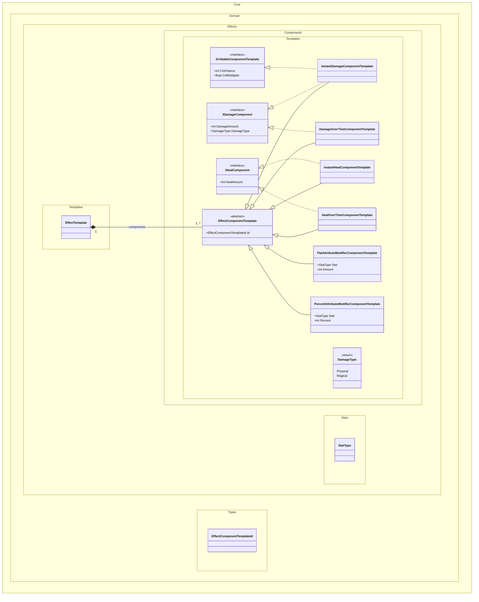

# EffectComponentTemplate

```mermaid
%%{init: {'themeVariables': { 'fontSize': '10px' }}}%%
classDiagram
  direction LR

  %% ============================================================
  %% EFFECT COMPONENT TEMPLATES
  %% Defines immutable component payloads used by effect instances.
  %% ============================================================

  %% ------------------------------------------------------------
  %% Primary Types
  %% ------------------------------------------------------------
  namespace Core.Domain.Effects.Components.Templates {
    %% Major Class: EffectComponentTemplate
    %% Abstract immutable base type for component templates.
    class EffectComponentTemplate {
      <<abstract>>
      +EffectComponentTemplateId Id
    }

    %% Major Class: IDamageComponent
    %% Capability interface for damage-producing components.
    class IDamageComponent {
      <<interface>>
      +int DamageAmount
      +DamageType DamageType
    }

    %% Major Class: IHealComponent
    %% Capability interface for healing-producing components.
    class IHealComponent {
      <<interface>>
      +int HealAmount
    }

    %% Major Class: ICrittableComponentTemplate
    %% Optional crit metadata for eligible damage templates.
    class ICrittableComponentTemplate {
      <<interface>>
      +int CritChance
      +float CritMultiplier
    }

    %% Major Class: InstantDamageComponentTemplate
    %% Single-application damage component.
    class InstantDamageComponentTemplate

    %% Major Class: DamageOverTimeComponentTemplate
    %% Damage component resolved on ticks.
    class DamageOverTimeComponentTemplate

    %% Major Class: InstantHealComponentTemplate
    %% Single-application heal component.
    class InstantHealComponentTemplate

    %% Major Class: HealOverTimeComponentTemplate
    %% Heal component resolved on ticks.
    class HealOverTimeComponentTemplate

    %% Major Class: FlatAttributeModifierComponentTemplate
    %% Adds a flat stat delta.
    class FlatAttributeModifierComponentTemplate {
      +StatType Stat
      +int Amount
    }

    %% Major Class: PercentAttributeModifierComponentTemplate
    %% Adds a percent stat delta.
    class PercentAttributeModifierComponentTemplate {
      +StatType Stat
      +int Percent
    }

    %% Major Class: DamageType
    %% Physical/magical damage channels.
    class DamageType {
      <<enum>>
      Physical
      Magical
    }
  }

  %% ------------------------------------------------------------
  %% Referenced Stubs
  %% ------------------------------------------------------------
  namespace Core.Domain.Effects.Stats {
    class StatType
  }

  namespace Core.Domain.Effects.Templates {
    class EffectTemplate
  }

  namespace Core.Domain.Types {
    class EffectComponentTemplateId
  }

  %% ------------------------------------------------------------
  %% Relationships
  %% ------------------------------------------------------------
  EffectComponentTemplate <|-- InstantDamageComponentTemplate
  EffectComponentTemplate <|-- DamageOverTimeComponentTemplate
  EffectComponentTemplate <|-- InstantHealComponentTemplate
  EffectComponentTemplate <|-- HealOverTimeComponentTemplate
  EffectComponentTemplate <|-- FlatAttributeModifierComponentTemplate
  EffectComponentTemplate <|-- PercentAttributeModifierComponentTemplate

  IDamageComponent <|.. InstantDamageComponentTemplate
  IDamageComponent <|.. DamageOverTimeComponentTemplate
  IHealComponent <|.. InstantHealComponentTemplate
  IHealComponent <|.. HealOverTimeComponentTemplate
  ICrittableComponentTemplate <|.. InstantDamageComponentTemplate

  EffectTemplate "1" *-- "1..*" EffectComponentTemplate : components

```
