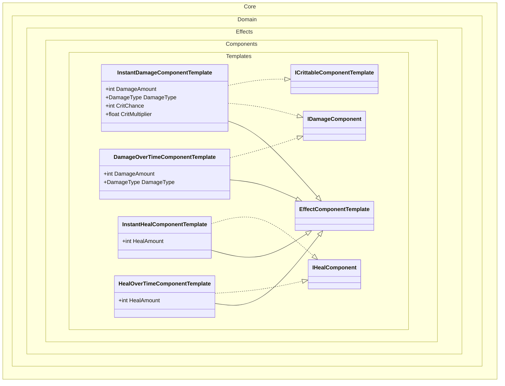

# EffectComponentTemplateConcrete

```mermaid
classDiagram
  direction LR

  %% ============================================================
  %% CONCRETE EFFECT COMPONENT TEMPLATES
  %% Template subclasses with concrete payload fields.
  %% ============================================================

  namespace Core.Domain.Effects.Components.Templates {
    %% Major Class: InstantDamageComponentTemplate
    class InstantDamageComponentTemplate {
      +int DamageAmount
      +DamageType DamageType
      +int CritChance
      +float CritMultiplier
    }

    %% Major Class: DamageOverTimeComponentTemplate
    class DamageOverTimeComponentTemplate {
      +int DamageAmount
      +DamageType DamageType
    }

    %% Major Class: InstantHealComponentTemplate
    class InstantHealComponentTemplate {
      +int HealAmount
    }

    %% Major Class: HealOverTimeComponentTemplate
    class HealOverTimeComponentTemplate {
      +int HealAmount
    }
  }

  namespace Core.Domain.Effects.Components.Templates {
    class EffectComponentTemplate
    class IDamageComponent
    class IHealComponent
    class ICrittableComponentTemplate
  }

  InstantDamageComponentTemplate --|> EffectComponentTemplate
  DamageOverTimeComponentTemplate --|> EffectComponentTemplate
  InstantHealComponentTemplate --|> EffectComponentTemplate
  HealOverTimeComponentTemplate --|> EffectComponentTemplate

  InstantDamageComponentTemplate ..|> IDamageComponent
  DamageOverTimeComponentTemplate ..|> IDamageComponent
  InstantHealComponentTemplate ..|> IHealComponent
  HealOverTimeComponentTemplate ..|> IHealComponent
  InstantDamageComponentTemplate ..|> ICrittableComponentTemplate

```
