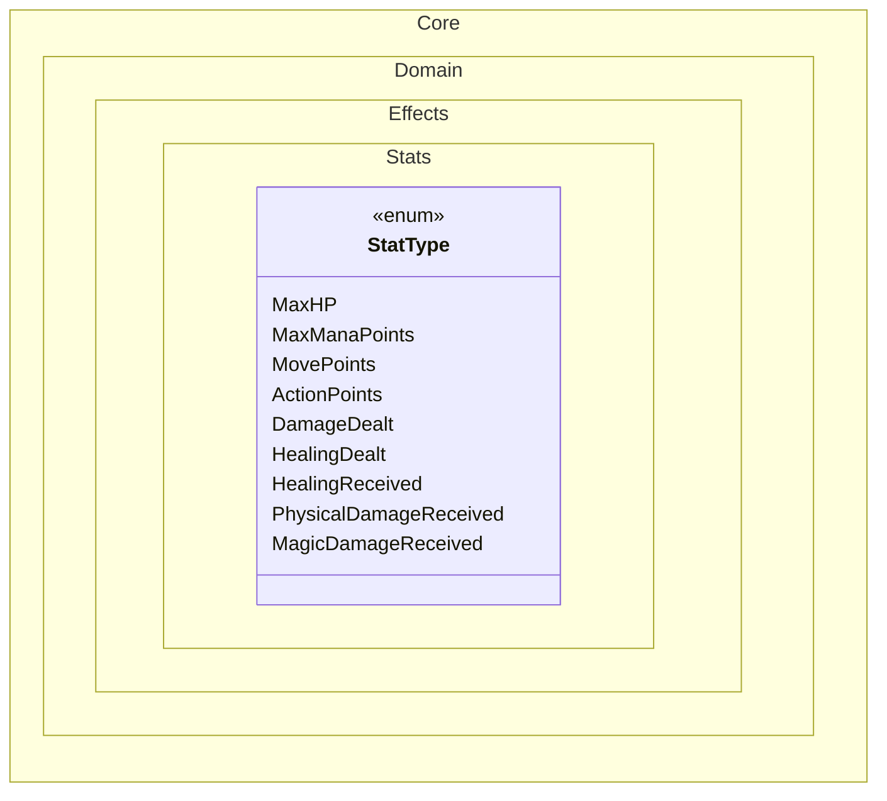

# StatType

```mermaid
classDiagram
  direction LR

  %% ============================================================
  %% EFFECT STAT TYPES
  %% Enumerates mutable derived stat channels used by effects.
  %% ============================================================

  namespace Core.Domain.Effects.Stats {
    %% Major Class: StatType
    class StatType {
      <<enum>>
      MaxHP
      MaxManaPoints
      MovePoints
      ActionPoints
      DamageDealt
      HealingDealt
      HealingReceived
      PhysicalDamageReceived
      MagicDamageReceived
    }
  }

```
