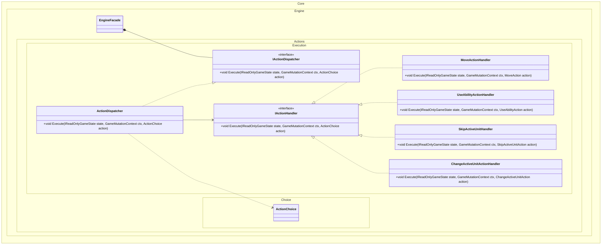

# ActionDispatcher

```mermaid
classDiagram
  direction LR

  %% ============================================================
  %% ACTION DISPATCHER
  %% Routes ActionChoice instances to concrete action handlers.
  %% ============================================================

  namespace Core.Engine.Actions.Execution {
    class IActionDispatcher {
      <<interface>>
      +void Execute(IReadOnlyGameState state, GameMutationContext ctx, ActionChoice action)
    }

    class ActionDispatcher {
      +void Execute(IReadOnlyGameState state, GameMutationContext ctx, ActionChoice action)
    }

    class IActionHandler {
      <<interface>>
      +void Execute(IReadOnlyGameState state, GameMutationContext ctx, ActionChoice action)
    }

    class MoveActionHandler {
      +void Execute(IReadOnlyGameState state, GameMutationContext ctx, MoveAction action)
    }

    class UseAbilityActionHandler {
      +void Execute(IReadOnlyGameState state, GameMutationContext ctx, UseAbilityAction action)
    }

    class SkipActiveUnitHandler {
      +void Execute(IReadOnlyGameState state, GameMutationContext ctx, SkipActiveUnitAction action)
    }

    class ChangeActiveUnitActionHandler {
      +void Execute(IReadOnlyGameState state, GameMutationContext ctx, ChangeActiveUnitAction action)
    }
  }

  %% ------------------------------------------------------------
  %% Referenced Stubs
  %% ------------------------------------------------------------

  namespace Core.Engine{
    class EngineFacade
  }
  namespace Core.Engine.Actions.Choice {
    class ActionChoice
  }

  %% ------------------------------------------------------------
  %% Relationships
  %% ------------------------------------------------------------

  EngineFacade *-- IActionDispatcher

  ActionDispatcher ..|> IActionDispatcher
  ActionDispatcher --> IActionHandler
  ActionDispatcher ..> ActionChoice

  IActionHandler <|.. MoveActionHandler
  IActionHandler <|.. UseAbilityActionHandler
  IActionHandler <|.. SkipActiveUnitHandler
  IActionHandler <|.. ChangeActiveUnitActionHandler

```
