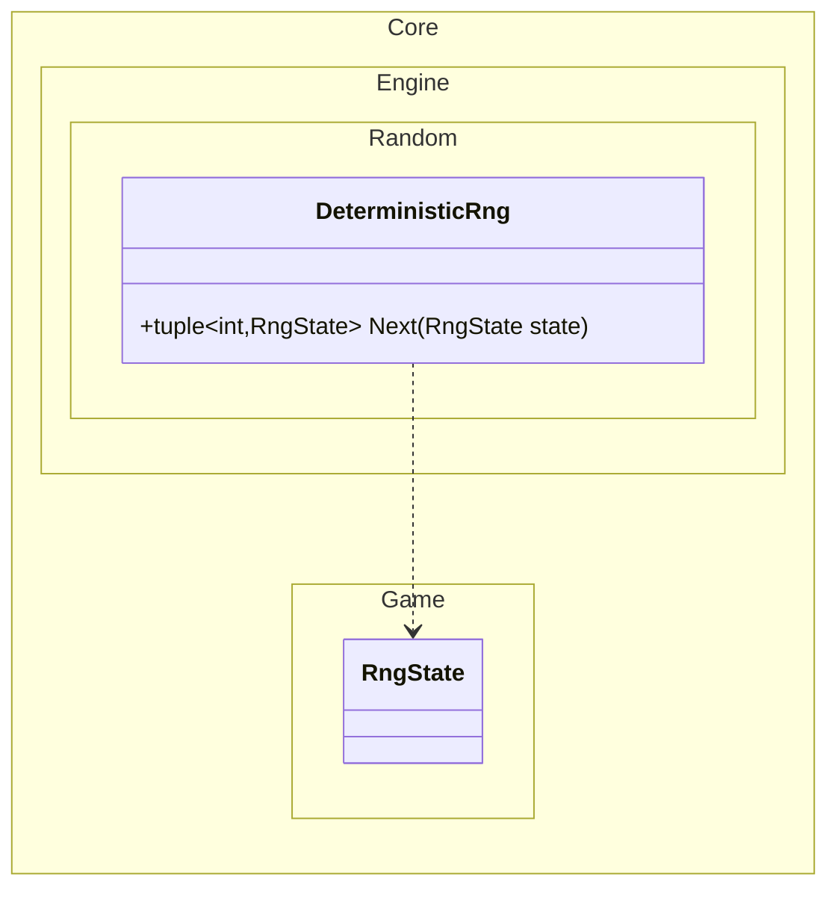

# DeterministicRng

```mermaid
classDiagram
  direction LR

  %% ============================================================
  %% DETERMINISTIC RNG
  %% Stateless RNG service operating over immutable RngState.
  %% ============================================================

  %% ------------------------------------------------------------
  %% Primary Types
  %% ------------------------------------------------------------
  namespace Core.Engine.Random {
    %% Major Class: DeterministicRng
    %% Computes pseudo-random values and the next RNG state.
    class DeterministicRng {
      +tuple~int,RngState~ Next(RngState state)
    }
  }

  %% ------------------------------------------------------------
  %% Referenced Stubs
  %% ------------------------------------------------------------
  namespace Core.Game {
    class RngState
  }

  %% ------------------------------------------------------------
  %% Relationships
  %% ------------------------------------------------------------
  DeterministicRng ..> RngState

```
