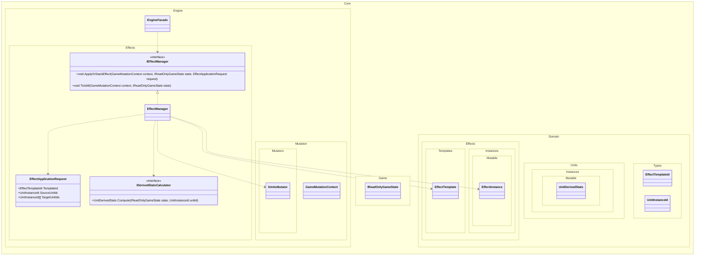

# EffectManager

```mermaid
classDiagram
  direction LR

  %% ============================================================
  %% EFFECT MANAGER
  %% Orchestrates effect application, ticking, and stat recomputation.
  %% ============================================================

  %% ------------------------------------------------------------
  %% Primary Types
  %% ------------------------------------------------------------
  namespace Core.Engine.Effects {
    %% Major Class: IEffectManager
    %% Public effect orchestration contract.
    class IEffectManager {
      <<interface>>
      +void ApplyOrStackEffect(GameMutationContext context, IReadOnlyGameState state, EffectApplicationRequest request)
      +void TickAll(GameMutationContext context, IReadOnlyGameState state)
    }

    %% Major Class: EffectApplicationRequest
    %% Input DTO for effect application from an ability action.
    class EffectApplicationRequest {
      +EffectTemplateId TemplateId
      +UnitInstanceId SourceUnitId
      +UnitInstanceId[] TargetUnitIds
    }

    %% Major Class: IDerivedStatsCalculator
    %% Recomputes a unit's effective derived stats from active effects.
    class IDerivedStatsCalculator {
      <<interface>>
      +UnitDerivedStats Compute(IReadOnlyGameState state, UnitInstanceId unitId)
    }

    %% Major Class: EffectManager
    %% Concrete effect runtime orchestrator.
    class EffectManager
  }

  %% ------------------------------------------------------------
  %% Referenced Stubs
  %% ------------------------------------------------------------
  namespace Core.Engine.Mutation {
    class GameMutationContext
  }

  namespace Core.Engine.Mutation.Mutators {
    class IUnitsMutator
  }

  namespace Core.Engine {
    class EngineFacade
  }

  namespace Core.Game {
    class IReadOnlyGameState
  }

  namespace Core.Domain.Effects.Templates {
    class EffectTemplate
  }

  namespace Core.Domain.Effects.Instances.Mutable {
    class EffectInstance
  }

  namespace Core.Domain.Units.Instances.Mutable {
    class UnitDerivedStats
  }

  namespace Core.Domain.Types {
    class EffectTemplateId
    class UnitInstanceId
  }

  %% ------------------------------------------------------------
  %% Relationships
  %% ------------------------------------------------------------
  IEffectManager <|.. EffectManager

  EngineFacade ..> IEffectManager

  EffectManager ..> EffectApplicationRequest
  EffectManager ..> IDerivedStatsCalculator
  EffectManager ..> IUnitsMutator
  EffectManager ..> EffectTemplate
  EffectManager ..> EffectInstance

```
