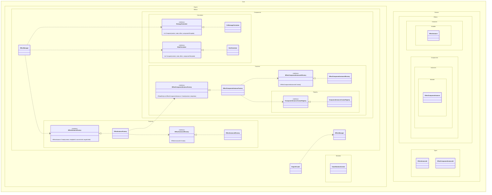

# Factories

```mermaid
%%{init: {'themeVariables': { 'fontSize': '9px' }}}%%
classDiagram
  direction LR

  %% ============================================================
  %% EFFECT FACTORIES AND CALCULATORS
  %% Construction graph for runtime effects/components and calculators.
  %% ============================================================

  %% ------------------------------------------------------------
  %% Primary Types
  %% ------------------------------------------------------------
  namespace Core.Engine.Effects.Components.Calculators {
    %% Major Class: IDamageCalculator
    %% Computes resolved damage values for damage components.
    class IDamageCalculator {
      <<interface>>
      +int Compute(context, state, effect, componentTemplate)
    }

    %% Major Class: CritDamageCalculator
    %% Concrete damage calculator with crit support.
    class CritDamageCalculator

    %% Major Class: IHealCalculator
    %% Computes resolved heal values for heal components.
    class IHealCalculator {
      <<interface>>
      +int Compute(context, state, effect, componentTemplate)
    }

    %% Major Class: HealCalculator
    %% Concrete healing calculator.
    class HealCalculator
  }

  namespace Core.Engine.Effects.Factories {
    %% Major Class: IEffectInstanceFactory
    %% Creates runtime EffectInstance objects from templates.
    class IEffectInstanceFactory {
      <<interface>>
      +EffectInstance Create(context, templateId, sourceUnitId, targetUnitId)
    }

    %% Major Class: EffectInstanceFactory
    %% Concrete effect-instance factory.
    class EffectInstanceFactory

    %% Major Class: IEffectInstanceIdFactory
    %% Allocates unique effect instance IDs.
    class IEffectInstanceIdFactory {
      <<interface>>
      +EffectInstanceId Create()
    }

    %% Major Class: EffectInstanceIdFactory
    %% Concrete effect instance ID allocator.
    class EffectInstanceIdFactory
  }

  namespace Core.Engine.Effects.Components.Factories {
    %% Major Class: IEffectComponentInstanceFactory
    %% Creates runtime component instances from component templates.
    class IEffectComponentInstanceFactory {
      <<interface>>
      +IReadOnlyList~EffectComponentInstance~ Create(context, templates)
    }

    %% Major Class: EffectComponentInstanceFactory
    %% Concrete component-instance factory.
    class EffectComponentInstanceFactory

    %% Major Class: IEffectComponentInstanceIdFactory
    %% Allocates unique effect component instance IDs.
    class IEffectComponentInstanceIdFactory {
      <<interface>>
      +EffectComponentInstanceId Create()
    }

    %% Major Class: EffectComponentInstanceIdFactory
    %% Concrete effect component ID allocator.
    class EffectComponentInstanceIdFactory
  }

  namespace Core.Engine.Effects.Components.Factories.Registry {
    %% Major Class: IComponentInstanceCreatorRegistry
    %% Registry mapping template kinds to component creators.
    class IComponentInstanceCreatorRegistry {
      <<interface>>
    }

    %% Major Class: ComponentInstanceCreatorRegistry
    %% Concrete creator registry used by component factory.
    class ComponentInstanceCreatorRegistry
  }

  %% ------------------------------------------------------------
  %% Referenced Stubs
  %% ------------------------------------------------------------
  namespace Core.Engine {
    class EngineFacade
  }

  namespace Core.Engine.Effects {
    class IEffectManager
    class EffectManager
  }

  namespace Core.Engine.Mutation {
    class GameMutationContext
  }

  namespace Core.Domain.Effects.Instances.Mutable {
    class EffectInstance
  }

  namespace Core.Domain.Effects.Components.Instances.Mutable {
    class EffectComponentInstance
  }

  namespace Core.Domain.Types {
    class EffectInstanceId
    class EffectComponentInstanceId
  }

  %% ------------------------------------------------------------
  %% Relationships
  %% ------------------------------------------------------------
  IDamageCalculator <|.. CritDamageCalculator
  IHealCalculator <|.. HealCalculator

  IEffectInstanceFactory <|.. EffectInstanceFactory
  IEffectInstanceIdFactory <|.. EffectInstanceIdFactory
  IEffectComponentInstanceFactory <|.. EffectComponentInstanceFactory
  IEffectComponentInstanceIdFactory <|.. EffectComponentInstanceIdFactory
  IComponentInstanceCreatorRegistry <|.. ComponentInstanceCreatorRegistry

  EffectInstanceFactory ..> IEffectInstanceIdFactory
  EffectInstanceFactory ..> IEffectComponentInstanceFactory
  EffectComponentInstanceFactory ..> IEffectComponentInstanceIdFactory
  EffectComponentInstanceFactory ..> IComponentInstanceCreatorRegistry

  EngineFacade ..> IEffectManager
  EffectManager ..> IEffectInstanceFactory
  EffectManager ..> IDamageCalculator
  EffectManager ..> IHealCalculator

```
