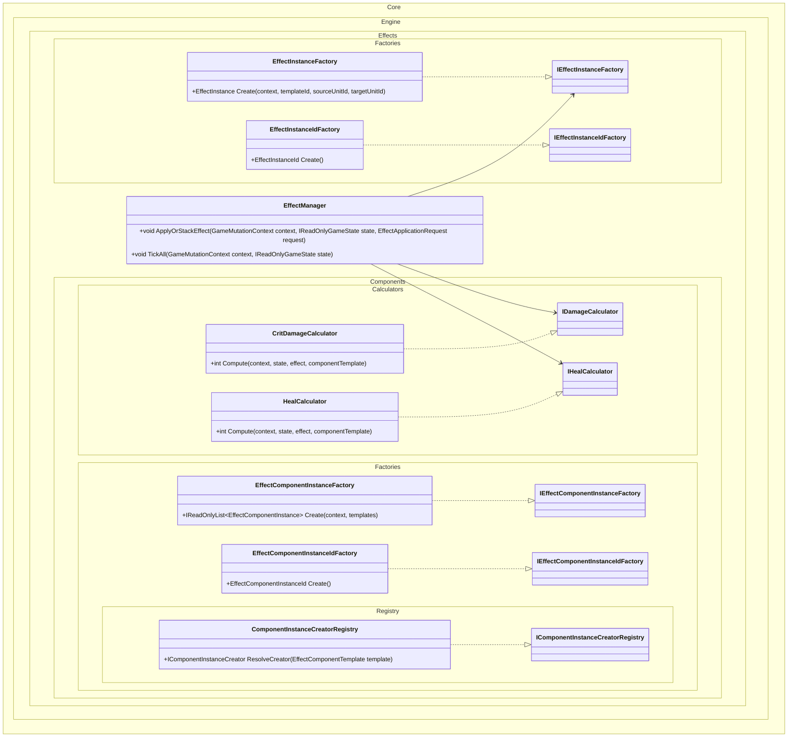

# EffectRuntimeServices

```mermaid
classDiagram
  direction LR

  %% ============================================================
  %% EFFECT RUNTIME SERVICES
  %% Concrete effect manager, factories, and calculators.
  %% ============================================================

  namespace Core.Engine.Effects {
    class EffectManager {
      +void ApplyOrStackEffect(GameMutationContext context, IReadOnlyGameState state, EffectApplicationRequest request)
      +void TickAll(GameMutationContext context, IReadOnlyGameState state)
    }
  }

  namespace Core.Engine.Effects.Factories {
    class EffectInstanceFactory {
      +EffectInstance Create(context, templateId, sourceUnitId, targetUnitId)
    }

    class EffectInstanceIdFactory {
      +EffectInstanceId Create()
    }
  }

  namespace Core.Engine.Effects.Components.Factories {
    class EffectComponentInstanceFactory {
      +IReadOnlyList~EffectComponentInstance~ Create(context, templates)
    }

    class EffectComponentInstanceIdFactory {
      +EffectComponentInstanceId Create()
    }
  }

  namespace Core.Engine.Effects.Components.Factories.Registry {
    class ComponentInstanceCreatorRegistry {
      +IComponentInstanceCreator ResolveCreator(EffectComponentTemplate template)
    }
  }

  namespace Core.Engine.Effects.Components.Calculators {
    class CritDamageCalculator {
      +int Compute(context, state, effect, componentTemplate)
    }

    class HealCalculator {
      +int Compute(context, state, effect, componentTemplate)
    }
  }

  namespace Core.Engine.Effects.Factories {
    class IEffectInstanceFactory
    class IEffectInstanceIdFactory
  }

  namespace Core.Engine.Effects.Components.Factories {
    class IEffectComponentInstanceFactory
    class IEffectComponentInstanceIdFactory
  }

  namespace Core.Engine.Effects.Components.Factories.Registry {
    class IComponentInstanceCreatorRegistry
  }

  namespace Core.Engine.Effects.Components.Calculators {
    class IDamageCalculator
    class IHealCalculator
  }

  EffectManager --> IEffectInstanceFactory
  EffectManager --> IDamageCalculator
  EffectManager --> IHealCalculator

  EffectInstanceFactory ..|> IEffectInstanceFactory
  EffectInstanceIdFactory ..|> IEffectInstanceIdFactory
  EffectComponentInstanceFactory ..|> IEffectComponentInstanceFactory
  EffectComponentInstanceIdFactory ..|> IEffectComponentInstanceIdFactory
  ComponentInstanceCreatorRegistry ..|> IComponentInstanceCreatorRegistry
  CritDamageCalculator ..|> IDamageCalculator
  HealCalculator ..|> IHealCalculator

```
