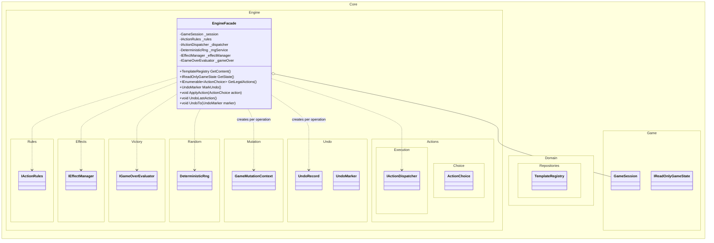

# EngineFacade

```mermaid
classDiagram
  direction LR

  %% ============================================================
  %% ENGINE FACADE
  %% Top-level simulation orchestration entrypoint.
  %% ============================================================

  %% ------------------------------------------------------------
  %% Primary Types
  %% ------------------------------------------------------------
  namespace Core.Engine {
    %% Major Class: EngineFacade
    %% Owns operation boundaries (apply action, undo, outcome recompute).
    class EngineFacade {
      -GameSession _session
      -IActionRules _rules
      -IActionDispatcher _dispatcher
      -DeterministicRng _rngService
      -IEffectManager _effectManager
      -IGameOverEvaluator _gameOver
      +TemplateRegistry GetContent()
      +IReadOnlyGameState GetState()
      +IEnumerable~ActionChoice~ GetLegalActions()
      +UndoMarker MarkUndo()
      +void ApplyAction(ActionChoice action)
      +void UndoLastAction()
      +void UndoTo(UndoMarker marker)
    }
  }

  %% ------------------------------------------------------------
  %% Referenced Stubs
  %% ------------------------------------------------------------
  namespace Core.Game {
    class GameSession
    class IReadOnlyGameState
  }

  namespace Core.Engine.Rules {
    class IActionRules
  }

  namespace Core.Engine.Actions.Execution {
    class IActionDispatcher
  }

  namespace Core.Engine.Mutation {
    class GameMutationContext
  }

  namespace Core.Engine.Effects {
    class IEffectManager
  }

  namespace Core.Engine.Random {
    class DeterministicRng
  }

  namespace Core.Engine.Victory {
    class IGameOverEvaluator
  }

  namespace Core.Engine.Actions.Choice {
    class ActionChoice
  }

  namespace Core.Engine.Undo {
    class UndoRecord
    class UndoMarker
  }

  namespace Core.Domain.Repositories {
    class TemplateRegistry
  }

  %% ------------------------------------------------------------
  %% Relationships
  %% ------------------------------------------------------------
  EngineFacade o-- GameSession
  EngineFacade ..> IActionRules
  EngineFacade ..> IActionDispatcher
  EngineFacade ..> IEffectManager
  EngineFacade ..> IGameOverEvaluator
  EngineFacade ..> DeterministicRng
  EngineFacade ..> GameMutationContext : creates per operation
  EngineFacade ..> UndoRecord : creates per operation

```
