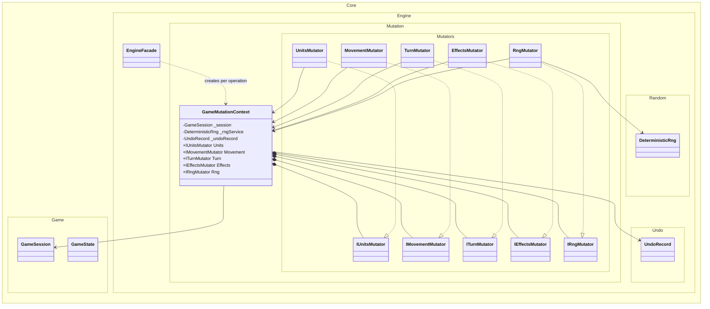

# GameMutationContext

```mermaid
classDiagram
  direction LR

  %% ============================================================
  %% GAME MUTATION CONTEXT
  %% Per-operation mutation gateway exposing grouped mutators.
  %% ============================================================

  %% ------------------------------------------------------------
  %% Primary Types
  %% ------------------------------------------------------------
  namespace Core.Engine.Mutation {
    %% Major Class: GameMutationContext
    %% Operation-scoped mutation root created by EngineFacade.
    class GameMutationContext {
      -GameSession _session
      -DeterministicRng _rngService
      -UndoRecord _undoRecord
      +IUnitsMutator Units
      +IMovementMutator Movement
      +ITurnMutator Turn
      +IEffectsMutator Effects
      +IRngMutator Rng
    }
  }

  namespace Core.Engine.Mutation.Mutators {
    %% Major Class: UnitsMutator
    %% Mutates unit resources/stats and records undo steps.
    class UnitsMutator

    %% Major Class: MovementMutator
    %% Mutates unit positions and occupancy state.
    class MovementMutator

    %% Major Class: TurnMutator
    %% Mutates turn and activation-phase data.
    class TurnMutator

    %% Major Class: EffectsMutator
    %% Mutates active effects and effect runtime state.
    class EffectsMutator

    %% Major Class: RngMutator
    %% Advances RNG state through deterministic service calls.
    class RngMutator

    class IUnitsMutator
    class IMovementMutator
    class ITurnMutator
    class IEffectsMutator
    class IRngMutator
  }

  %% ------------------------------------------------------------
  %% Referenced Stubs
  %% ------------------------------------------------------------
  namespace Core.Game {
    class GameSession
    class GameState
  }

  namespace Core.Engine.Random {
    class DeterministicRng
  }

  namespace Core.Engine.Undo {
    class UndoRecord
  }

  namespace Core.Engine {
    class EngineFacade
  }

  %% ------------------------------------------------------------
  %% Relationships
  %% ------------------------------------------------------------
  GameMutationContext *-- IUnitsMutator
  GameMutationContext *-- IMovementMutator
  GameMutationContext *-- ITurnMutator
  GameMutationContext *-- IEffectsMutator
  GameMutationContext *-- IRngMutator

  UnitsMutator ..|> IUnitsMutator
  MovementMutator ..|> IMovementMutator
  TurnMutator ..|> ITurnMutator
  EffectsMutator ..|> IEffectsMutator
  RngMutator ..|> IRngMutator

  UnitsMutator --> GameMutationContext
  MovementMutator --> GameMutationContext
  TurnMutator --> GameMutationContext
  EffectsMutator --> GameMutationContext
  RngMutator --> GameMutationContext

  GameMutationContext --> GameSession
  GameMutationContext --> UndoRecord
  RngMutator --> DeterministicRng
  EngineFacade ..> GameMutationContext : creates per operation

```
