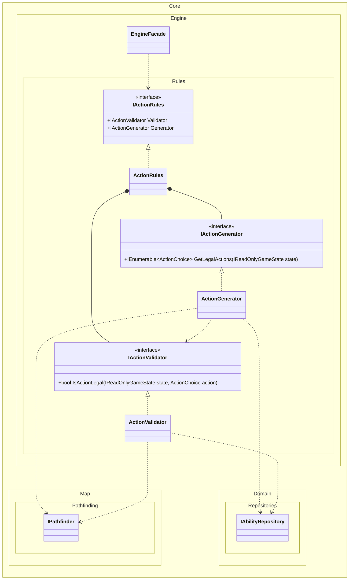

# IActionRules

```mermaid
classDiagram
  direction LR

  %% ============================================================
  %% ACTION RULES
  %% ============================================================

  namespace Core.Engine.Rules {
    class IActionRules {
      <<interface>>
      +IActionValidator Validator
      +IActionGenerator Generator
    }
    class ActionRules

    class IActionGenerator {
      <<interface>>
      +IEnumerable~ActionChoice~ GetLegalActions(IReadOnlyGameState state)
    }

    class ActionGenerator

    class IActionValidator {
      <<interface>>
      +bool IsActionLegal(IReadOnlyGameState state, ActionChoice action)
    }
    
    class ActionValidator
  }

  %% ------------------------------------------------------------
  %% Referenced Stubs
  %% ------------------------------------------------------------

  namespace Core.Engine {
    class EngineFacade
  }

  namespace Core.Map.Pathfinding {
    class IPathfinder
  }

  namespace Core.Domain.Repositories {
    class IAbilityRepository
  }

  %% ------------------------------------------------------------
  %% Relationships
  %% ------------------------------------------------------------

  IActionRules <|.. ActionRules
  IActionGenerator <|.. ActionGenerator
  IActionValidator <|.. ActionValidator

  ActionRules *-- IActionValidator
  ActionRules *-- IActionGenerator

  ActionGenerator ..> IPathfinder
  ActionGenerator ..> IAbilityRepository
  ActionGenerator ..> IActionValidator

  ActionValidator ..> IPathfinder
  ActionValidator ..> IAbilityRepository

  EngineFacade ..> IActionRules

```
