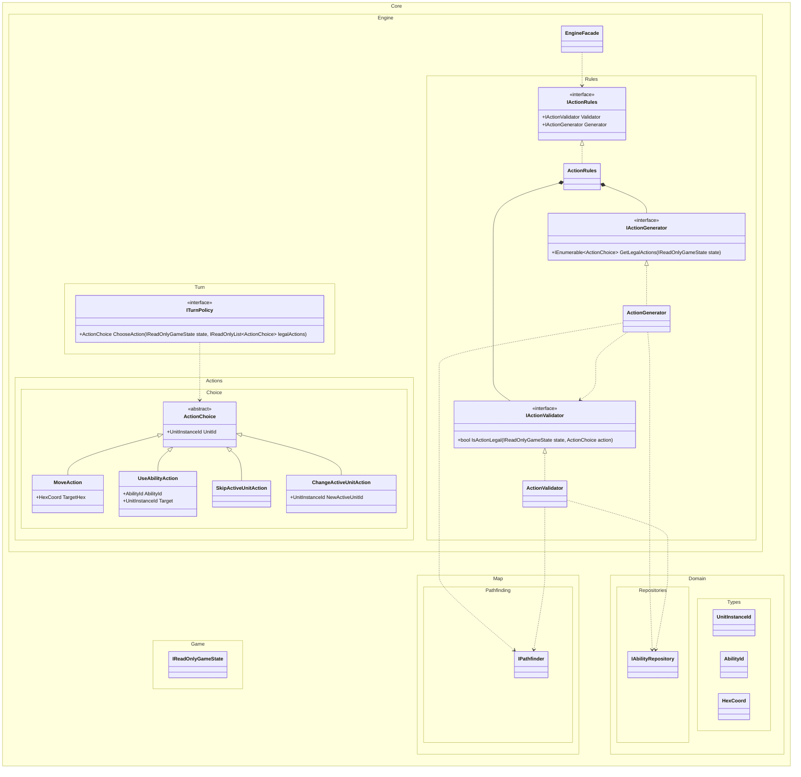

# IGameRules+IturnPolicy

```mermaid
classDiagram
  direction LR

  %% ============================================================
  %% ACTION RULES AND TURN POLICY
  %% Action shape + rule generation/validation + external policy selection.
  %% ============================================================

  %% ------------------------------------------------------------
  %% Primary Types
  %% ------------------------------------------------------------
  namespace Core.Engine.Actions.Choice {
    %% Major Class: ActionChoice
    %% Abstract player decision root type.
    class ActionChoice {
      <<abstract>>
      +UnitInstanceId UnitId
    }

    %% Major Class: MoveAction
    %% Move issuer to a target hex.
    class MoveAction {
      +HexCoord TargetHex
    }

    %% Major Class: UseAbilityAction
    %% Use ability against a selected target unit.
    class UseAbilityAction {
      +AbilityId AbilityId
      +UnitInstanceId Target
    }

    %% Major Class: SkipActiveUnitAction
    %% End current active unit participation for this phase step.
    class SkipActiveUnitAction

    %% Major Class: ChangeActiveUnitAction
    %% Switch currently active unit to another allied unit.
    class ChangeActiveUnitAction {
      +UnitInstanceId NewActiveUnitId
    }
  }

  namespace Core.Engine.Rules {
    %% Major Class: IActionRules
    %% Composition contract for generator + validator services.
    class IActionRules {
      <<interface>>
      +IActionValidator Validator
      +IActionGenerator Generator
    }

    %% Major Class: ActionRules
    %% Concrete holder for generator/validator dependencies.
    class ActionRules

    %% Major Class: IActionGenerator
    %% Produces legal actions from a read-only state.
    class IActionGenerator {
      <<interface>>
      +IEnumerable~ActionChoice~ GetLegalActions(IReadOnlyGameState state)
    }

    %% Major Class: ActionGenerator
    %% Concrete legal-action generation service.
    class ActionGenerator

    %% Major Class: IActionValidator
    %% Validates whether a proposed action is legal.
    class IActionValidator {
      <<interface>>
      +bool IsActionLegal(IReadOnlyGameState state, ActionChoice action)
    }

    %% Major Class: ActionValidator
    %% Concrete action legality validator.
    class ActionValidator
  }

  namespace Core.Engine.Turn {
    %% Major Class: ITurnPolicy
    %% External strategy for selecting one action from legal actions.
    class ITurnPolicy {
      <<interface>>
      +ActionChoice ChooseAction(IReadOnlyGameState state, IReadOnlyList~ActionChoice~ legalActions)
    }
  }

  %% ------------------------------------------------------------
  %% Referenced Stubs
  %% ------------------------------------------------------------
  namespace Core.Engine {
    class EngineFacade
  }

  namespace Core.Game {
    class IReadOnlyGameState
  }

  namespace Core.Map.Pathfinding {
    class IPathfinder
  }

  namespace Core.Domain.Repositories {
    class IAbilityRepository
  }

  namespace Core.Domain.Types {
    class UnitInstanceId
    class AbilityId
    class HexCoord
  }

  %% ------------------------------------------------------------
  %% Relationships
  %% ------------------------------------------------------------
  ActionChoice <|-- MoveAction
  ActionChoice <|-- UseAbilityAction
  ActionChoice <|-- SkipActiveUnitAction
  ActionChoice <|-- ChangeActiveUnitAction

  IActionRules <|.. ActionRules
  IActionGenerator <|.. ActionGenerator
  IActionValidator <|.. ActionValidator

  ActionRules *-- IActionValidator
  ActionRules *-- IActionGenerator

  ActionGenerator ..> IPathfinder
  ActionGenerator ..> IAbilityRepository
  ActionGenerator ..> IActionValidator

  ActionValidator ..> IPathfinder
  ActionValidator ..> IAbilityRepository

  ITurnPolicy ..> ActionChoice
  EngineFacade ..> IActionRules

```
