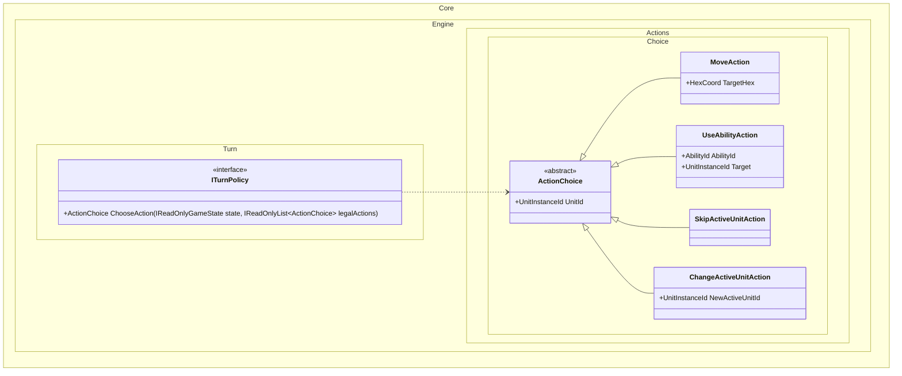

# ITurnPolicy

```mermaid
classDiagram
  direction LR

  %% ============================================================
  %% TURN POLICY
  %% ============================================================

  namespace Core.Engine.Turn {
    class ITurnPolicy {
      <<interface>>
      +ActionChoice ChooseAction(IReadOnlyGameState state, IReadOnlyList~ActionChoice~ legalActions)
    }
  }
  
  namespace Core.Engine.Actions.Choice {
    class ActionChoice {
      <<abstract>>
      +UnitInstanceId UnitId
    }

    class MoveAction {
      +HexCoord TargetHex
    }

    class UseAbilityAction {
      +AbilityId AbilityId
      +UnitInstanceId Target
    }

    class SkipActiveUnitAction

    class ChangeActiveUnitAction {
      +UnitInstanceId NewActiveUnitId
    }
  }

  %% ------------------------------------------------------------
  %% Relationships
  %% ------------------------------------------------------------
  
  ITurnPolicy ..> ActionChoice

  ActionChoice <|-- MoveAction
  ActionChoice <|-- UseAbilityAction
  ActionChoice <|-- SkipActiveUnitAction
  ActionChoice <|-- ChangeActiveUnitAction


```
