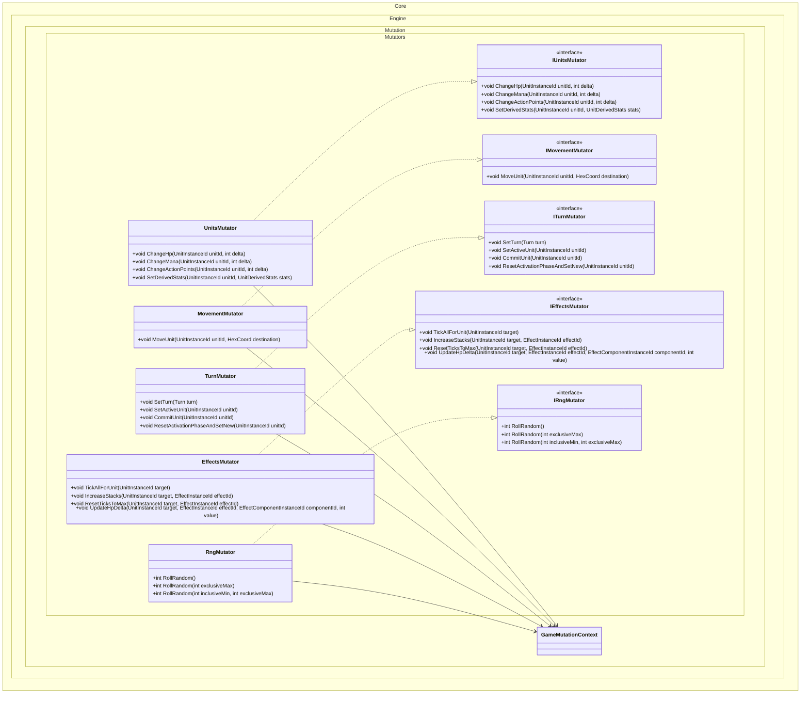

# Mutators

```mermaid
classDiagram
  direction LR

  %% ============================================================
  %% MUTATORS
  %% Concrete mutation services and their public interfaces.
  %% ============================================================

  namespace Core.Engine.Mutation.Mutators {
    class IUnitsMutator {
      <<interface>>
      +void ChangeHp(UnitInstanceId unitId, int delta)
      +void ChangeMana(UnitInstanceId unitId, int delta)
      +void ChangeActionPoints(UnitInstanceId unitId, int delta)
      +void SetDerivedStats(UnitInstanceId unitId, UnitDerivedStats stats)
    }

    class IMovementMutator {
      <<interface>>
      +void MoveUnit(UnitInstanceId unitId, HexCoord destination)
    }

    class ITurnMutator {
      <<interface>>
      +void SetTurn(Turn turn)
      +void SetActiveUnit(UnitInstanceId unitId)
      +void CommitUnit(UnitInstanceId unitId)
      +void ResetActivationPhaseAndSetNew(UnitInstanceId unitId)
    }

    class IEffectsMutator {
      <<interface>>
      +void TickAllForUnit(UnitInstanceId target)
      +void IncreaseStacks(UnitInstanceId target, EffectInstanceId effectId)
      +void ResetTicksToMax(UnitInstanceId target, EffectInstanceId effectId)
      +void UpdateHpDelta(UnitInstanceId target, EffectInstanceId effectId, EffectComponentInstanceId componentId, int value)
    }

    class IRngMutator {
      <<interface>>
      +int RollRandom()
      +int RollRandom(int exclusiveMax)
      +int RollRandom(int inclusiveMin, int exclusiveMax)
    }

    class UnitsMutator {
      +void ChangeHp(UnitInstanceId unitId, int delta)
      +void ChangeMana(UnitInstanceId unitId, int delta)
      +void ChangeActionPoints(UnitInstanceId unitId, int delta)
      +void SetDerivedStats(UnitInstanceId unitId, UnitDerivedStats stats)
    }

    class MovementMutator {
      +void MoveUnit(UnitInstanceId unitId, HexCoord destination)
    }

    class TurnMutator {
      +void SetTurn(Turn turn)
      +void SetActiveUnit(UnitInstanceId unitId)
      +void CommitUnit(UnitInstanceId unitId)
      +void ResetActivationPhaseAndSetNew(UnitInstanceId unitId)
    }

    class EffectsMutator {
      +void TickAllForUnit(UnitInstanceId target)
      +void IncreaseStacks(UnitInstanceId target, EffectInstanceId effectId)
      +void ResetTicksToMax(UnitInstanceId target, EffectInstanceId effectId)
      +void UpdateHpDelta(UnitInstanceId target, EffectInstanceId effectId, EffectComponentInstanceId componentId, int value)
    }

    class RngMutator {
      +int RollRandom()
      +int RollRandom(int exclusiveMax)
      +int RollRandom(int inclusiveMin, int exclusiveMax)
    }
  }

  namespace Core.Engine.Mutation {
    class GameMutationContext
  }

  UnitsMutator ..|> IUnitsMutator
  MovementMutator ..|> IMovementMutator
  TurnMutator ..|> ITurnMutator
  EffectsMutator ..|> IEffectsMutator
  RngMutator ..|> IRngMutator

  UnitsMutator --> GameMutationContext
  MovementMutator --> GameMutationContext
  TurnMutator --> GameMutationContext
  EffectsMutator --> GameMutationContext
  RngMutator --> GameMutationContext

```
