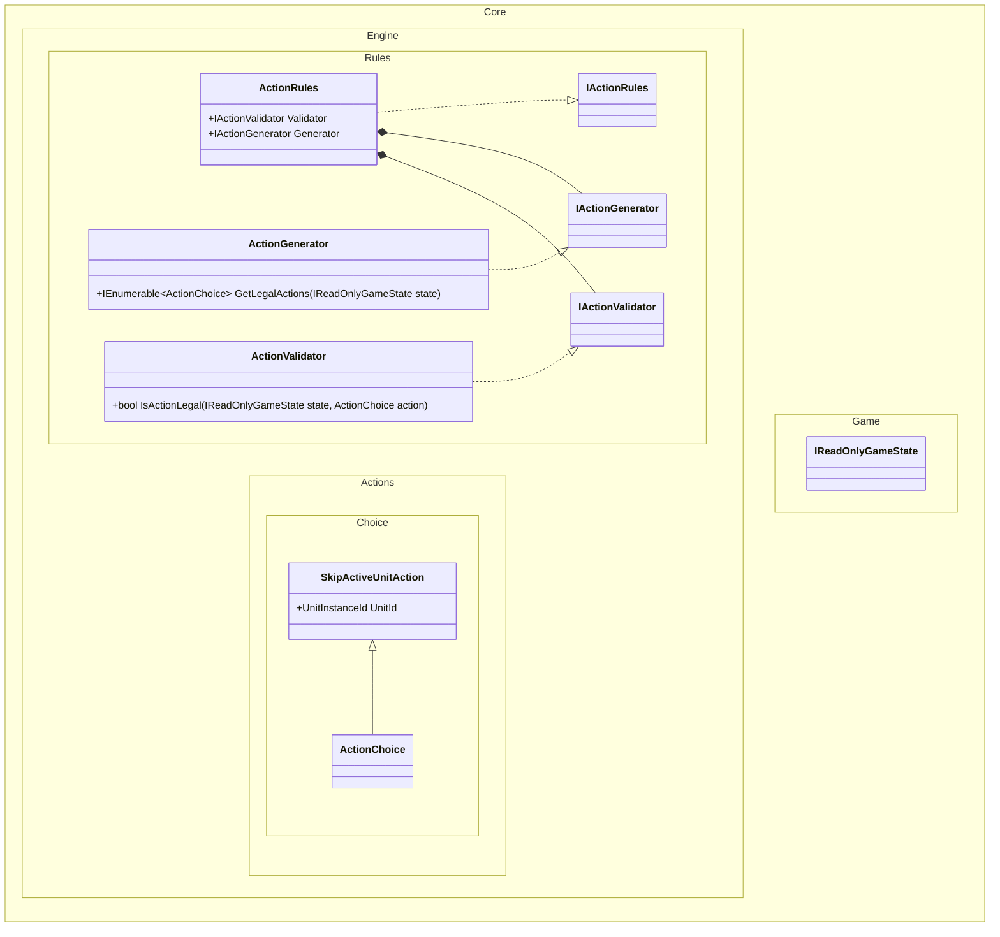

# ActionRuleImplementations

```mermaid
classDiagram
  direction LR

  %% ============================================================
  %% ACTION RULE IMPLEMENTATIONS
  %% Concrete legal-action generation and validation services.
  %% ============================================================

  namespace Core.Engine.Rules {
    %% Major Class: ActionRules
    %% Composition of validator and generator services.
    class ActionRules {
      +IActionValidator Validator
      +IActionGenerator Generator
    }

    %% Major Class: ActionGenerator
    %% Builds legal actions for active team and unit context.
    class ActionGenerator {
      +IEnumerable~ActionChoice~ GetLegalActions(IReadOnlyGameState state)
    }

    %% Major Class: ActionValidator
    %% Enforces action legality constraints.
    class ActionValidator {
      +bool IsActionLegal(IReadOnlyGameState state, ActionChoice action)
    }
  }

  namespace Core.Engine.Actions.Choice {
    %% Major Class: SkipActiveUnitAction
    class SkipActiveUnitAction {
      +UnitInstanceId UnitId
    }
  }

  namespace Core.Engine.Rules {
    class IActionRules
    class IActionGenerator
    class IActionValidator
  }

  namespace Core.Game {
    class IReadOnlyGameState
  }

  namespace Core.Engine.Actions.Choice {
    class ActionChoice
  }

  ActionRules ..|> IActionRules
  ActionGenerator ..|> IActionGenerator
  ActionValidator ..|> IActionValidator
  SkipActiveUnitAction <|-- ActionChoice
  ActionRules *-- IActionGenerator
  ActionRules *-- IActionValidator

```
