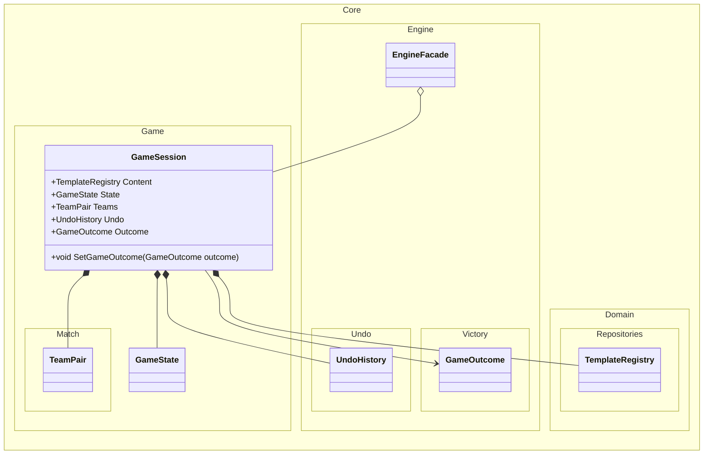

# GameSession

```mermaid
classDiagram
  direction LR

  %% ============================================================
  %% GAME SESSION
  %% Match-scoped container for static content and mutable game state.
  %% ============================================================

  %% ------------------------------------------------------------
  %% Primary Types
  %% ------------------------------------------------------------
  namespace Core.Game {
    %% Major Class: GameSession
    %% Owns content, state, teams, undo history, and current outcome.
    class GameSession {
      +TemplateRegistry Content
      +GameState State
      +TeamPair Teams
      +UndoHistory Undo
      +GameOutcome Outcome
      +void SetGameOutcome(GameOutcome outcome)
    }
  }

  %% ------------------------------------------------------------
  %% Referenced Stubs
  %% ------------------------------------------------------------
  namespace Core.Domain.Repositories {
    class TemplateRegistry
  }

  namespace Core.Game {
    class GameState
  }

  namespace Core.Game.Match {
    class TeamPair
  }

  namespace Core.Engine.Undo {
    class UndoHistory
  }

  namespace Core.Engine.Victory {
    class GameOutcome
  }

  namespace Core.Engine {
    class EngineFacade
  }

  %% ------------------------------------------------------------
  %% Relationships
  %% ------------------------------------------------------------
  GameSession *-- TemplateRegistry
  GameSession *-- GameState
  GameSession *-- TeamPair
  GameSession *-- UndoHistory
  GameSession --> GameOutcome

  EngineFacade o-- GameSession

```
