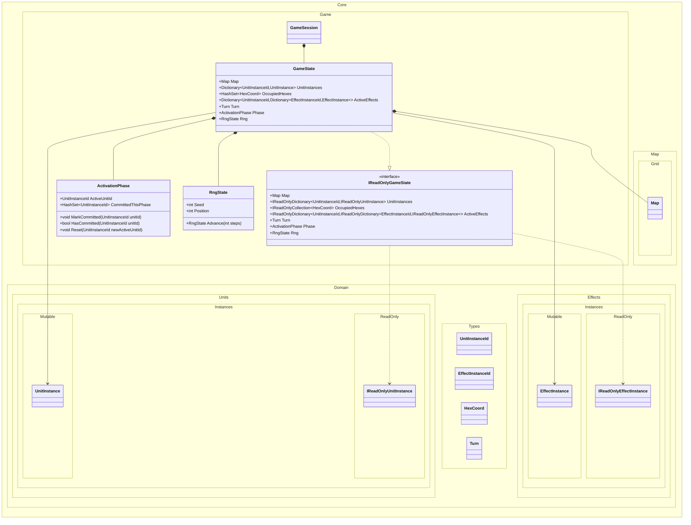

# GameState

```mermaid
classDiagram
  direction LR

  %% ============================================================
  %% GAME STATE
  %% Complete mutable runtime state for one match.
  %% ============================================================

  %% ------------------------------------------------------------
  %% Primary Types
  %% ------------------------------------------------------------
  namespace Core.Game {
    %% Major Class: IReadOnlyGameState
    %% Query-only projection consumed by validators/generators and AI.
    class IReadOnlyGameState {
      <<interface>>
      +Map Map
      +IReadOnlyDictionary~UnitInstanceId,IReadOnlyUnitInstance~ UnitInstances
      +IReadOnlyCollection~HexCoord~ OccupiedHexes
      +IReadOnlyDictionary~UnitInstanceId,IReadOnlyDictionary~EffectInstanceId,IReadOnlyEffectInstance~~ ActiveEffects
      +Turn Turn
      +ActivationPhase Phase
      +RngState Rng
    }

    %% Major Class: ActivationPhase
    %% Tracks active unit and committed units for the acting team.
    class ActivationPhase {
      +UnitInstanceId ActiveUnitId
      +HashSet~UnitInstanceId~ CommittedThisPhase
      +void MarkCommitted(UnitInstanceId unitId)
      +bool HasCommitted(UnitInstanceId unitId)
      +void Reset(UnitInstanceId newActiveUnitId)
    }

    %% Major Class: RngState
    %% Immutable RNG cursor embedded in game state.
    class RngState {
      +int Seed
      +int Position
      +RngState Advance(int steps)
    }

    %% Major Class: GameState
    %% Mutable state aggregate owned by GameSession.
    class GameState {
      +Map Map
      +Dictionary~UnitInstanceId,UnitInstance~ UnitInstances
      +HashSet~HexCoord~ OccupiedHexes
      +Dictionary~UnitInstanceId,Dictionary~EffectInstanceId,EffectInstance~~ ActiveEffects
      +Turn Turn
      +ActivationPhase Phase
      +RngState Rng
    }
  }

  %% ------------------------------------------------------------
  %% Referenced Stubs
  %% ------------------------------------------------------------
  namespace Core.Map.Grid {
    class Map
  }

  namespace Core.Domain.Units.Instances.Mutable {
    class UnitInstance
  }

  namespace Core.Domain.Units.Instances.ReadOnly {
    class IReadOnlyUnitInstance
  }

  namespace Core.Domain.Effects.Instances.Mutable {
    class EffectInstance
  }

  namespace Core.Domain.Effects.Instances.ReadOnly {
    class IReadOnlyEffectInstance
  }

  namespace Core.Domain.Types {
    class UnitInstanceId
    class EffectInstanceId
    class HexCoord
    class Turn
  }

  namespace Core.Game {
    class GameSession
  }

  %% ------------------------------------------------------------
  %% Relationships
  %% ------------------------------------------------------------
  GameState ..|> IReadOnlyGameState

  GameState *-- Map
  GameState *-- ActivationPhase
  GameState *-- RngState

  GameState --> UnitInstance
  GameState --> EffectInstance

  IReadOnlyGameState ..> IReadOnlyUnitInstance
  IReadOnlyGameState ..> IReadOnlyEffectInstance

  GameSession *-- GameState

```
