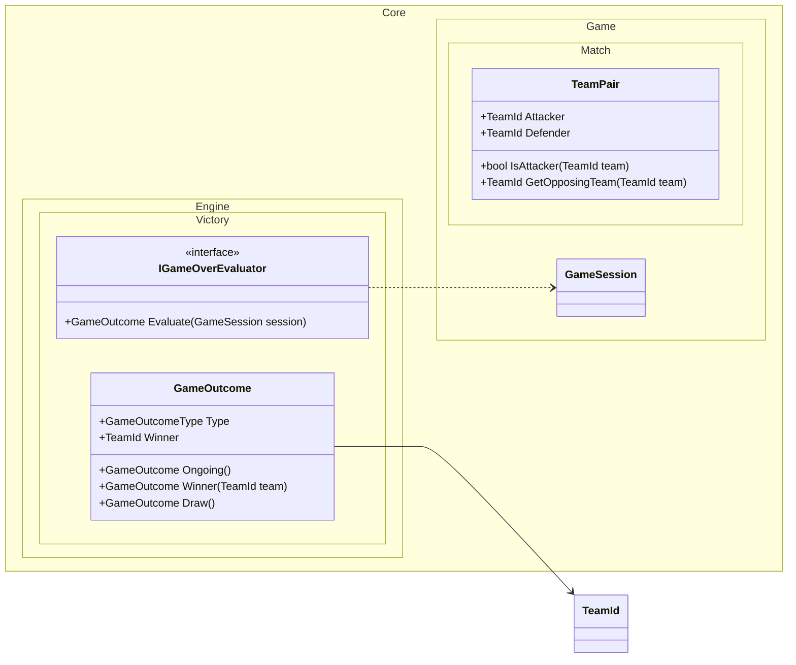

# MatchOutcome

```mermaid
classDiagram
  direction LR

  %% ============================================================
  %% MATCH OUTCOME TYPES
  %% Team pairing and game outcome evaluation contracts.
  %% ============================================================

  namespace Core.Game.Match {
    %% Major Class: TeamPair
    class TeamPair {
      +TeamId Attacker
      +TeamId Defender
      +bool IsAttacker(TeamId team)
      +TeamId GetOpposingTeam(TeamId team)
    }
  }

  namespace Core.Engine.Victory {
    %% Major Class: GameOutcome
    class GameOutcome {
      +GameOutcomeType Type
      +TeamId Winner
      +GameOutcome Ongoing()
      +GameOutcome Winner(TeamId team)
      +GameOutcome Draw()
    }

    %% Major Class: IGameOverEvaluator
    class IGameOverEvaluator {
      <<interface>>
      +GameOutcome Evaluate(GameSession session)
    }
  }

  namespace Core.Game {
    class GameSession
  }

  GameOutcome --> TeamId
  IGameOverEvaluator ..> GameSession

```
