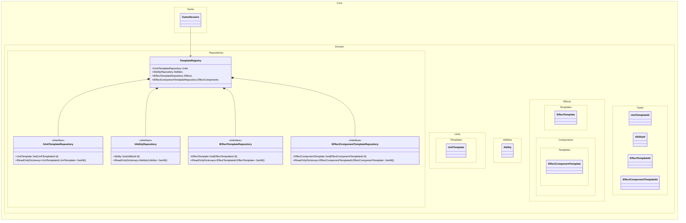

# TemplateRegistry

```mermaid
classDiagram
  direction LR

  %% ============================================================
  %% TEMPLATE REGISTRY
  %% Aggregates read-only repositories for compiled content templates.
  %% ============================================================

  %% ------------------------------------------------------------
  %% Primary Types
  %% ------------------------------------------------------------
  namespace Core.Domain.Repositories {
    %% Major Class: IUnitTemplateRepository
    %% Unit template lookup contract.
    class IUnitTemplateRepository {
      <<interface>>
      +UnitTemplate Get(UnitTemplateId id)
      +IReadOnlyDictionary~UnitTemplateId,UnitTemplate~ GetAll()
    }

    %% Major Class: IAbilityRepository
    %% Ability lookup contract.
    class IAbilityRepository {
      <<interface>>
      +Ability Get(AbilityId id)
      +IReadOnlyDictionary~AbilityId,Ability~ GetAll()
    }

    %% Major Class: IEffectTemplateRepository
    %% Effect template lookup contract.
    class IEffectTemplateRepository {
      <<interface>>
      +EffectTemplate Get(EffectTemplateId id)
      +IReadOnlyDictionary~EffectTemplateId,EffectTemplate~ GetAll()
    }

    %% Major Class: IEffectComponentTemplateRepository
    %% Effect component template lookup contract.
    class IEffectComponentTemplateRepository {
      <<interface>>
      +EffectComponentTemplate Get(EffectComponentTemplateId id)
      +IReadOnlyDictionary~EffectComponentTemplateId,EffectComponentTemplate~ GetAll()
    }

    %% Major Class: TemplateRegistry
    %% Immutable repository aggregate owned by GameSession.
    class TemplateRegistry {
      +IUnitTemplateRepository Units
      +IAbilityRepository Abilities
      +IEffectTemplateRepository Effects
      +IEffectComponentTemplateRepository EffectComponents
    }
  }

  %% ------------------------------------------------------------
  %% Referenced Stubs
  %% ------------------------------------------------------------
  namespace Core.Domain.Units.Templates {
    class UnitTemplate
  }

  namespace Core.Domain.Abilities {
    class Ability
  }

  namespace Core.Domain.Effects.Templates {
    class EffectTemplate
  }

  namespace Core.Domain.Effects.Components.Templates {
    class EffectComponentTemplate
  }

  namespace Core.Domain.Types {
    class UnitTemplateId
    class AbilityId
    class EffectTemplateId
    class EffectComponentTemplateId
  }

  namespace Core.Game {
    class GameSession
  }

  %% ------------------------------------------------------------
  %% Relationships
  %% ------------------------------------------------------------
  TemplateRegistry *-- IUnitTemplateRepository
  TemplateRegistry *-- IAbilityRepository
  TemplateRegistry *-- IEffectTemplateRepository
  TemplateRegistry *-- IEffectComponentTemplateRepository

  GameSession --> TemplateRegistry

```
