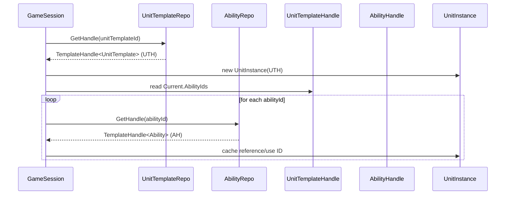

# test

```mermaid
sequenceDiagram
  %% ============================================================
  %% TEMPLATE LOOKUP FLOW (EXAMPLE)
  %% Shows how session code resolves template-backed unit data.
  %% ============================================================

  participant GS as GameSession
  participant UR as UnitTemplateRepo
  participant AR as AbilityRepo
  participant UTH as UnitTemplateHandle
  participant AH as AbilityHandle
  participant UI as UnitInstance

  GS->>UR: GetHandle(unitTemplateId)
  UR-->>GS: TemplateHandle<UnitTemplate> (UTH)
  GS->>UI: new UnitInstance(UTH)
  GS->>UTH: read Current.AbilityIds

  loop for each abilityId
    GS->>AR: GetHandle(abilityId)
    AR-->>GS: TemplateHandle<Ability> (AH)
    GS->>UI: cache reference/use ID
  end

```
