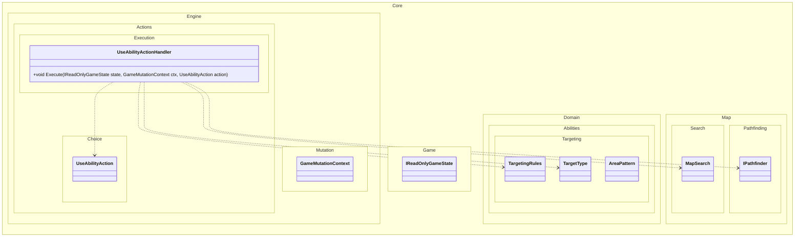

# AreaPatternResolver

```mermaid
classDiagram
  direction LR

  %% ============================================================
  %% AREA TARGETING FLOW
  %% Documents ability targeting dependencies used at execution time.
  %% ============================================================

  %% ------------------------------------------------------------
  %% Primary Types
  %% ------------------------------------------------------------
  namespace Core.Engine.Actions.Execution {
    %% Major Class: UseAbilityActionHandler
    %% Resolves valid targets and applies effect requests.
    class UseAbilityActionHandler {
      +void Execute(IReadOnlyGameState state, GameMutationContext ctx, UseAbilityAction action)
    }
  }

  %% ------------------------------------------------------------
  %% Referenced Stubs
  %% ------------------------------------------------------------
  namespace Core.Domain.Abilities.Targeting {
    class TargetingRules
    class AreaPattern
    class TargetType
  }

  namespace Core.Map.Search {
    class MapSearch
  }

  namespace Core.Map.Pathfinding {
    class IPathfinder
  }

  namespace Core.Game {
    class IReadOnlyGameState
  }

  namespace Core.Engine.Mutation {
    class GameMutationContext
  }

  namespace Core.Engine.Actions.Choice {
    class UseAbilityAction
  }

  %% ------------------------------------------------------------
  %% Relationships
  %% ------------------------------------------------------------
  UseAbilityActionHandler ..> TargetingRules
  UseAbilityActionHandler ..> TargetType
  UseAbilityActionHandler ..> MapSearch
  UseAbilityActionHandler ..> IPathfinder
  UseAbilityActionHandler ..> UseAbilityAction

```
