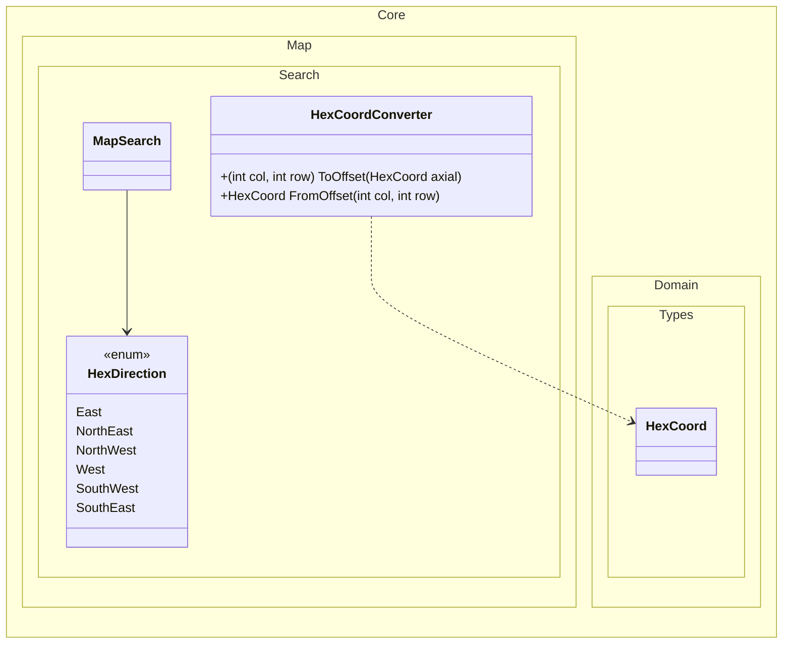

# HexMath

```mermaid
classDiagram
  direction LR

  %% ============================================================
  %% HEX UTILITIES
  %% Hex direction enum and coordinate conversion helpers.
  %% ============================================================

  %% ------------------------------------------------------------
  %% Primary Types
  %% ------------------------------------------------------------
  namespace Core.Map.Search {
    %% Major Class: HexDirection
    %% Canonical ordering for axial neighbor directions.
    class HexDirection {
      <<enum>>
      East
      NorthEast
      NorthWest
      West
      SouthWest
      SouthEast
    }

    %% Major Class: HexCoordConverter
    %% Converts axial coordinates to/from offset storage coordinates.
    class HexCoordConverter {
      +(int col, int row) ToOffset(HexCoord axial)
      +HexCoord FromOffset(int col, int row)
    }
  }

  %% ------------------------------------------------------------
  %% Referenced Stubs
  %% ------------------------------------------------------------
  namespace Core.Map.Search {
    class MapSearch
  }

  namespace Core.Domain.Types {
    class HexCoord
  }

  %% ------------------------------------------------------------
  %% Relationships
  %% ------------------------------------------------------------
  HexCoordConverter ..> HexCoord
  MapSearch --> HexDirection

```
