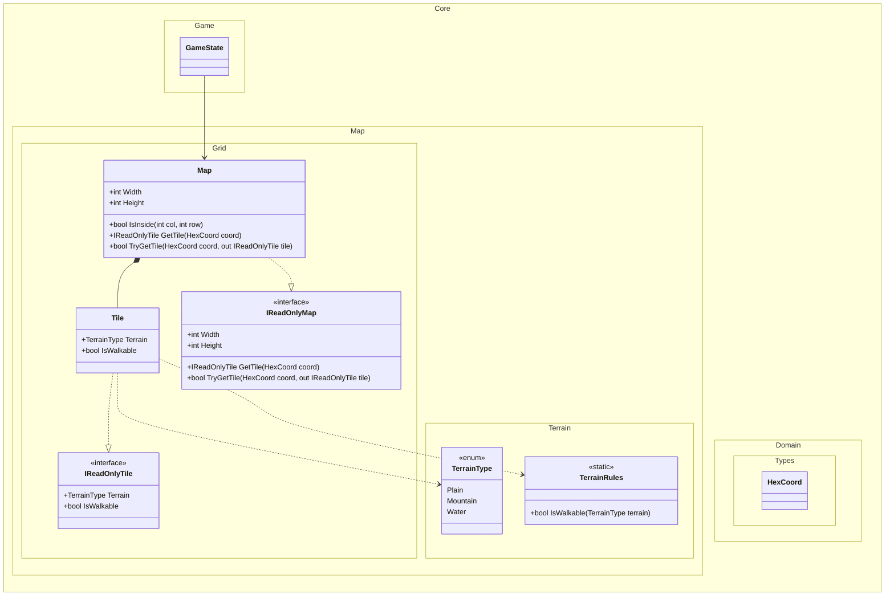

# Map

```mermaid
classDiagram
  direction LR

  %% ============================================================
  %% MAP GRID
  %% Tile storage and read-only access contracts.
  %% ============================================================

  %% ------------------------------------------------------------
  %% Primary Types
  %% ------------------------------------------------------------
  namespace Core.Map.Grid {
    %% Major Class: IReadOnlyTile
    %% Read-only tile surface exposed to map/query systems.
    class IReadOnlyTile {
      <<interface>>
      +TerrainType Terrain
      +bool IsWalkable
    }

    %% Major Class: IReadOnlyMap
    %% Read-only map contract used by search/pathfinding.
    class IReadOnlyMap {
      <<interface>>
      +int Width
      +int Height
      +IReadOnlyTile GetTile(HexCoord coord)
      +bool TryGetTile(HexCoord coord, out IReadOnlyTile tile)
    }

    %% Major Class: Tile
    %% Concrete mutable tile implementation.
    class Tile {
      +TerrainType Terrain
      +bool IsWalkable
    }

    %% Major Class: Map
    %% Concrete map implementation with hex coordinate lookup.
    class Map {
      +int Width
      +int Height
      +bool IsInside(int col, int row)
      +IReadOnlyTile GetTile(HexCoord coord)
      +bool TryGetTile(HexCoord coord, out IReadOnlyTile tile)
    }
  }

  namespace Core.Map.Terrain {
    %% Major Class: TerrainType
    %% Terrain classification for tile behavior.
    class TerrainType {
      <<enum>>
      Plain
      Mountain
      Water
    }

    %% Major Class: TerrainRules
    %% Static terrain utility functions.
    class TerrainRules {
      <<static>>
      +bool IsWalkable(TerrainType terrain)
    }
  }

  %% ------------------------------------------------------------
  %% Referenced Stubs
  %% ------------------------------------------------------------
  namespace Core.Domain.Types {
    class HexCoord
  }

  namespace Core.Game {
    class GameState
  }

  %% ------------------------------------------------------------
  %% Relationships
  %% ------------------------------------------------------------
  Tile ..|> IReadOnlyTile
  Map ..|> IReadOnlyMap

  Map *-- Tile
  Tile ..> TerrainType
  Tile ..> TerrainRules

  GameState --> Map

```
