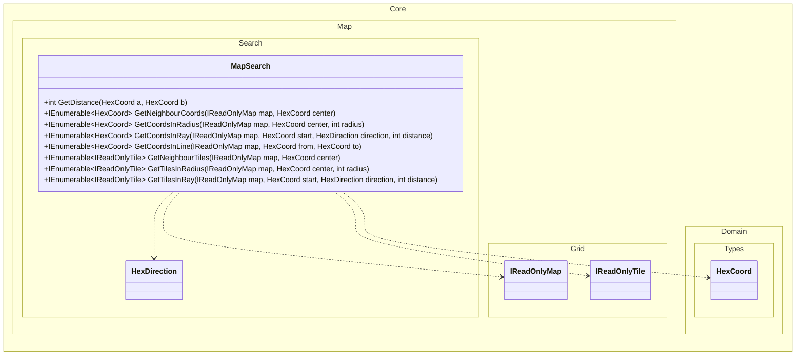

# MapSearch

```mermaid
classDiagram
  direction LR

  %% ============================================================
  %% MAP SEARCH
  %% Map-bounded spatial query helpers (neighbors, radius, rays, lines).
  %% ============================================================

  %% ------------------------------------------------------------
  %% Primary Types
  %% ------------------------------------------------------------
  namespace Core.Map.Search {
    %% Major Class: MapSearch
    %% Static query utility over IReadOnlyMap and HexCoord.
    class MapSearch {
      +int GetDistance(HexCoord a, HexCoord b)
      +IEnumerable~HexCoord~ GetNeighbourCoords(IReadOnlyMap map, HexCoord center)
      +IEnumerable~HexCoord~ GetCoordsInRadius(IReadOnlyMap map, HexCoord center, int radius)
      +IEnumerable~HexCoord~ GetCoordsInRay(IReadOnlyMap map, HexCoord start, HexDirection direction, int distance)
      +IEnumerable~HexCoord~ GetCoordsInLine(IReadOnlyMap map, HexCoord from, HexCoord to)
      +IEnumerable~IReadOnlyTile~ GetNeighbourTiles(IReadOnlyMap map, HexCoord center)
      +IEnumerable~IReadOnlyTile~ GetTilesInRadius(IReadOnlyMap map, HexCoord center, int radius)
      +IEnumerable~IReadOnlyTile~ GetTilesInRay(IReadOnlyMap map, HexCoord start, HexDirection direction, int distance)
    }
  }

  %% ------------------------------------------------------------
  %% Referenced Stubs
  %% ------------------------------------------------------------
  namespace Core.Map.Grid {
    class IReadOnlyMap
    class IReadOnlyTile
  }

  namespace Core.Map.Search {
    class HexDirection
  }

  namespace Core.Domain.Types {
    class HexCoord
  }

  %% ------------------------------------------------------------
  %% Relationships
  %% ------------------------------------------------------------
  MapSearch ..> IReadOnlyMap
  MapSearch ..> IReadOnlyTile
  MapSearch ..> HexCoord
  MapSearch ..> HexDirection

```
