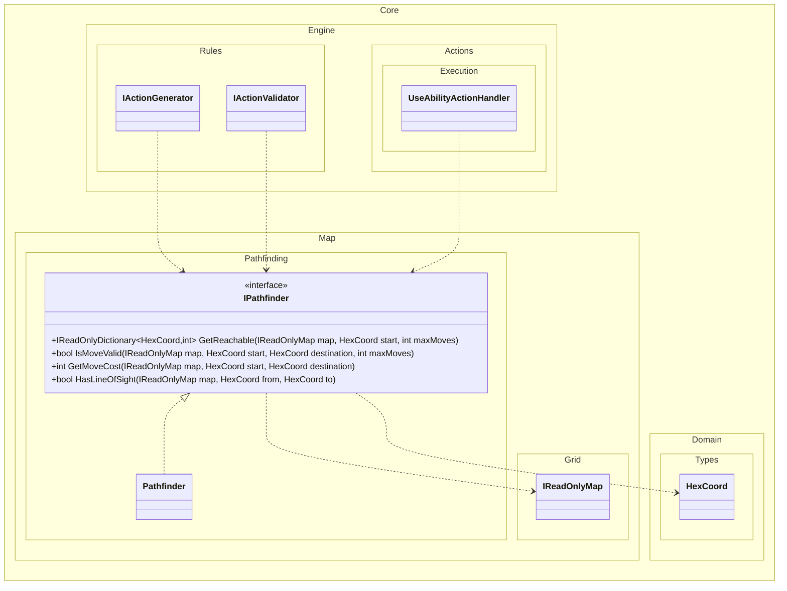

# Pathfinding

```mermaid
classDiagram
  direction LR

  %% ============================================================
  %% PATHFINDING
  %% Reachability, move validation, path cost, and line-of-sight service.
  %% ============================================================

  %% ------------------------------------------------------------
  %% Primary Types
  %% ------------------------------------------------------------
  namespace Core.Map.Pathfinding {
    %% Major Class: IPathfinder
    %% Contract for path and visibility queries over IReadOnlyMap.
    class IPathfinder {
      <<interface>>
      +IReadOnlyDictionary~HexCoord,int~ GetReachable(IReadOnlyMap map, HexCoord start, int maxMoves)
      +bool IsMoveValid(IReadOnlyMap map, HexCoord start, HexCoord destination, int maxMoves)
      +int GetMoveCost(IReadOnlyMap map, HexCoord start, HexCoord destination)
      +bool HasLineOfSight(IReadOnlyMap map, HexCoord from, HexCoord to)
    }

    %% Major Class: Pathfinder
    %% BFS-based concrete implementation used by rules and handlers.
    class Pathfinder
  }

  %% ------------------------------------------------------------
  %% Referenced Stubs
  %% ------------------------------------------------------------
  namespace Core.Map.Grid {
    class IReadOnlyMap
  }

  namespace Core.Domain.Types {
    class HexCoord
  }

  namespace Core.Engine.Rules {
    class IActionGenerator
    class IActionValidator
  }

  namespace Core.Engine.Actions.Execution {
    class UseAbilityActionHandler
  }

  %% ------------------------------------------------------------
  %% Relationships
  %% ------------------------------------------------------------
  IPathfinder <|.. Pathfinder

  IPathfinder ..> IReadOnlyMap
  IPathfinder ..> HexCoord

  IActionGenerator ..> IPathfinder
  IActionValidator ..> IPathfinder
  UseAbilityActionHandler ..> IPathfinder

```
