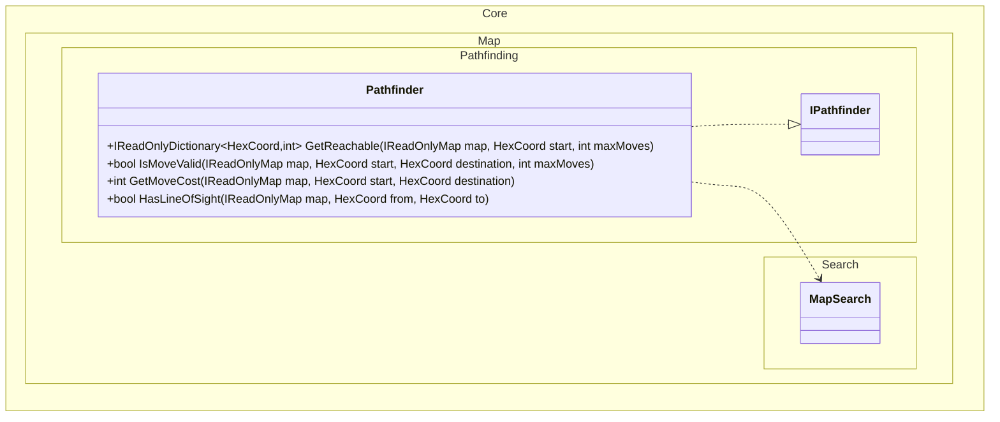

# Pathfinder

```mermaid
classDiagram
  direction LR

  %% ============================================================
  %% PATHFINDER IMPLEMENTATION
  %% Concrete BFS path/visibility logic.
  %% ============================================================

  namespace Core.Map.Pathfinding {
    %% Major Class: Pathfinder
    class Pathfinder {
      +IReadOnlyDictionary~HexCoord,int~ GetReachable(IReadOnlyMap map, HexCoord start, int maxMoves)
      +bool IsMoveValid(IReadOnlyMap map, HexCoord start, HexCoord destination, int maxMoves)
      +int GetMoveCost(IReadOnlyMap map, HexCoord start, HexCoord destination)
      +bool HasLineOfSight(IReadOnlyMap map, HexCoord from, HexCoord to)
    }

    class IPathfinder
  }

  namespace Core.Map.Search {
    class MapSearch
  }

  Pathfinder ..|> IPathfinder
  Pathfinder ..> MapSearch

```
