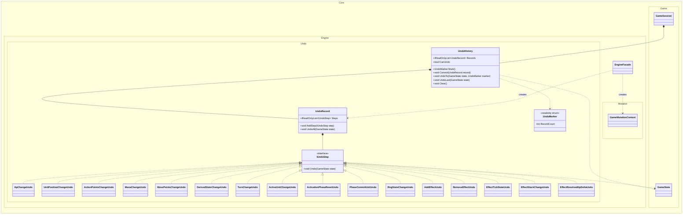

# UndoHistory

```mermaid
classDiagram
  direction LR

  %% ============================================================
  %% UNDO HISTORY
  %% Match-scoped undo record stack and concrete undo-step examples.
  %% ============================================================

  %% ------------------------------------------------------------
  %% Primary Types
  %% ------------------------------------------------------------
  namespace Core.Engine.Undo {
    %% Major Class: IUndoStep
    %% Single reversible mutation step contract.
    class IUndoStep {
      <<interface>>
      +void Undo(GameState state)
    }

    %% Major Class: UndoRecord
    %% Operation-scoped collection of undo steps.
    class UndoRecord {
      +IReadOnlyList~IUndoStep~ Steps
      +void AddStep(IUndoStep step)
      +void UndoAll(GameState state)
    }

    %% Major Class: UndoMarker
    %% Marker identifying a record count checkpoint.
    class UndoMarker {
      <<readonly struct>>
      +int RecordCount
    }

    %% Major Class: UndoHistory
    %% Match-scoped stack of committed undo records.
    class UndoHistory {
      +IReadOnlyList~UndoRecord~ Records
      +bool CanUndo
      +UndoMarker Mark()
      +void Commit(UndoRecord record)
      +void UndoTo(GameState state, UndoMarker marker)
      +void UndoLast(GameState state)
      +void Clear()
    }

    %% Major Class: Concrete Undo Steps
    %% Representative reversible mutations recorded by mutators.
    class HpChangeUndo
    class UnitPositionChangeUndo
    class ActionPointsChangeUndo
    class ManaChangeUndo
    class MovePointsChangeUndo
    class DerivedStatsChangeUndo
    class TurnChangeUndo
    class ActiveUnitChangeUndo
    class ActivationPhaseResetUndo
    class PhaseCommitUnitUndo
    class RngStateChangeUndo
    class AddEffectUndo
    class RemoveEffectUndo
    class EffectTickStateUndo
    class EffectStackChangeUndo
    class EffectResolvedHpDeltaUndo
  }

  %% ------------------------------------------------------------
  %% Referenced Stubs
  %% ------------------------------------------------------------
  namespace Core.Game {
    class GameState
    class GameSession
  }

  namespace Core.Engine {
    class EngineFacade
  }

  namespace Core.Engine.Mutation {
    class GameMutationContext
  }

  %% ------------------------------------------------------------
  %% Relationships
  %% ------------------------------------------------------------
  UndoHistory *-- UndoRecord
  UndoRecord *-- IUndoStep
  UndoHistory ..> UndoMarker

  IUndoStep <|.. HpChangeUndo
  IUndoStep <|.. UnitPositionChangeUndo
  IUndoStep <|.. ActionPointsChangeUndo
  IUndoStep <|.. ManaChangeUndo
  IUndoStep <|.. MovePointsChangeUndo
  IUndoStep <|.. DerivedStatsChangeUndo
  IUndoStep <|.. TurnChangeUndo
  IUndoStep <|.. ActiveUnitChangeUndo
  IUndoStep <|.. ActivationPhaseResetUndo
  IUndoStep <|.. PhaseCommitUnitUndo
  IUndoStep <|.. RngStateChangeUndo
  IUndoStep <|.. AddEffectUndo
  IUndoStep <|.. RemoveEffectUndo
  IUndoStep <|.. EffectTickStateUndo
  IUndoStep <|.. EffectStackChangeUndo
  IUndoStep <|.. EffectResolvedHpDeltaUndo

  IUndoStep ..> GameState
  UndoHistory ..> GameState
  GameSession *-- UndoHistory

  EngineFacade ..> UndoRecord : creates
  EngineFacade ..> GameMutationContext : creates

```
