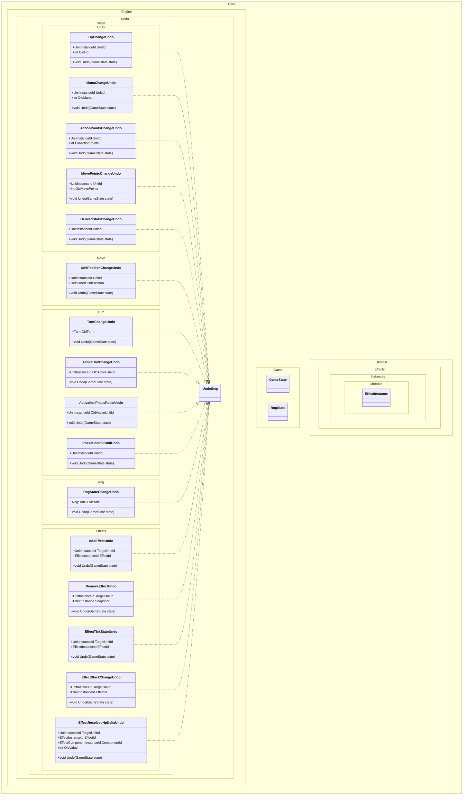

# UndoSteps

```mermaid
classDiagram
  direction LR

  %% ============================================================
  %% UNDO STEPS
  %% Concrete reversible step types used within UndoRecord.
  %% ============================================================

  namespace Core.Engine.Undo.Steps.Units {
    class HpChangeUndo {
      +UnitInstanceId UnitId
      +int OldHp
      +void Undo(GameState state)
    }

    class ManaChangeUndo {
      +UnitInstanceId UnitId
      +int OldMana
      +void Undo(GameState state)
    }

    class ActionPointsChangeUndo {
      +UnitInstanceId UnitId
      +int OldActionPoints
      +void Undo(GameState state)
    }

    class MovePointsChangeUndo {
      +UnitInstanceId UnitId
      +int OldMovePoints
      +void Undo(GameState state)
    }

    class DerivedStatsChangeUndo {
      +UnitInstanceId UnitId
      +void Undo(GameState state)
    }
  }

  namespace Core.Engine.Undo.Steps.Move {
    class UnitPositionChangeUndo {
      +UnitInstanceId UnitId
      +HexCoord OldPosition
      +void Undo(GameState state)
    }
  }

  namespace Core.Engine.Undo.Steps.Turn {
    class TurnChangeUndo {
      +Turn OldTurn
      +void Undo(GameState state)
    }

    class ActiveUnitChangeUndo {
      +UnitInstanceId OldActiveUnitId
      +void Undo(GameState state)
    }

    class ActivationPhaseResetUndo {
      +UnitInstanceId OldActiveUnitId
      +void Undo(GameState state)
    }

    class PhaseCommitUnitUndo {
      +UnitInstanceId UnitId
      +void Undo(GameState state)
    }
  }

  namespace Core.Engine.Undo.Steps.Rng {
    class RngStateChangeUndo {
      +RngState OldState
      +void Undo(GameState state)
    }
  }

  namespace Core.Engine.Undo.Steps.Effects {
    class AddEffectUndo {
      +UnitInstanceId TargetUnitId
      +EffectInstanceId EffectId
      +void Undo(GameState state)
    }

    class RemoveEffectUndo {
      +UnitInstanceId TargetUnitId
      +EffectInstance Snapshot
      +void Undo(GameState state)
    }

    class EffectTickStateUndo {
      +UnitInstanceId TargetUnitId
      +EffectInstanceId EffectId
      +void Undo(GameState state)
    }

    class EffectStackChangeUndo {
      +UnitInstanceId TargetUnitId
      +EffectInstanceId EffectId
      +void Undo(GameState state)
    }

    class EffectResolvedHpDeltaUndo {
      +UnitInstanceId TargetUnitId
      +EffectInstanceId EffectId
      +EffectComponentInstanceId ComponentId
      +int OldValue
      +void Undo(GameState state)
    }
  }

  namespace Core.Engine.Undo {
    class IUndoStep
  }

  namespace Core.Game {
    class GameState
    class RngState
  }

  namespace Core.Domain.Effects.Instances.Mutable {
    class EffectInstance
  }

  HpChangeUndo ..|> IUndoStep
  ManaChangeUndo ..|> IUndoStep
  ActionPointsChangeUndo ..|> IUndoStep
  MovePointsChangeUndo ..|> IUndoStep
  DerivedStatsChangeUndo ..|> IUndoStep
  UnitPositionChangeUndo ..|> IUndoStep
  TurnChangeUndo ..|> IUndoStep
  ActiveUnitChangeUndo ..|> IUndoStep
  ActivationPhaseResetUndo ..|> IUndoStep
  PhaseCommitUnitUndo ..|> IUndoStep
  RngStateChangeUndo ..|> IUndoStep
  AddEffectUndo ..|> IUndoStep
  RemoveEffectUndo ..|> IUndoStep
  EffectTickStateUndo ..|> IUndoStep
  EffectStackChangeUndo ..|> IUndoStep
  EffectResolvedHpDeltaUndo ..|> IUndoStep

```
