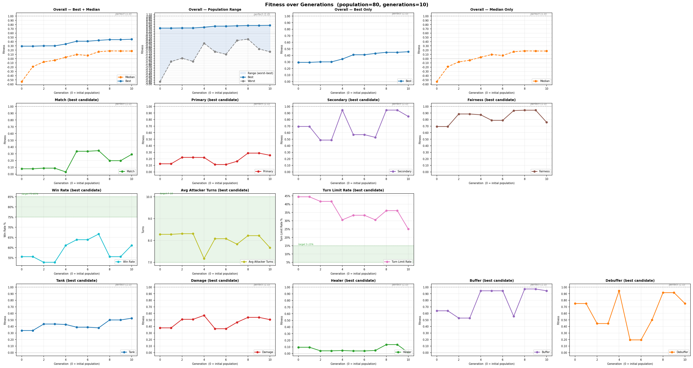
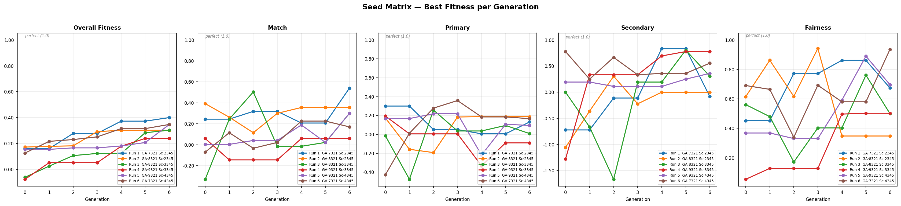

# Balancer Results: No-Movement Runs

Completed balancer runs were conducted using the no-movement content variant only. The standard movement-enabled variant was not run to completion because simulation time per generation was too long given the available hardware and time budget. Removing movement as a variable substantially reduces per-match computation time, making full GA runs feasible.

The no-movement variant uses `content-no-move/`, fixes all unit `movePoints` to `0`, disables move-point genome tuning, and disables movement-related scoring targets. All other balancing objectives remain active. See [Full Genome Balancer](../full-genome-balancer.md) for a full explanation of the workflow.

## Main Run

**Config:** GA seed `9482716`, scenario seed `7654321`, population size `80`, `10` generations, `36` generated scenarios, MCTS iteration budget `128`.

Configs used:
- [tools/configs/ga/full-genome-no-move.json](../../tools/configs/ga/full-genome-no-move.json)
- [tools/configs/balance/full-genome-no-move.json](../../tools/configs/balance/full-genome-no-move.json)
- [tools/configs/scenario/full-genome-no-move-scenario-eval.json](../../tools/configs/scenario/full-genome-no-move-scenario-eval.json)

The main run searched for improved content starting from the unmodified `content-no-move/` baseline. The best candidate was selected at the end of generation 10.

### Fitness Over Generations

The top row shows overall fitness (best, median, and population range) across all 10 generations. The best candidate climbs from a negative baseline fitness into positive territory, converging around `0.46` by the final generation. The population range narrows over time as the search converges.

The lower rows show per-metric scores for the best candidate at each generation: match flow, primary role identity, secondary role identity, fairness, win rate, average attacker turns, turn limit rate, and individual role scores (Tank, Damage, Healer, Buffer, Debuffer).

### Outcome

| Metric | Before | After | Delta | Improved |
| --- | ---: | ---: | ---: | :---: |
| Fitness | `-0.2627` | `0.4558` | `+0.7185` | Yes |
| AttackerWinRate | `0.6389` | `0.6111` | `-0.0278` | |
| TurnLimitRate | `0.2500` | `0.2500` | `0.0000` | No |
| AverageAttackerTurns | `6.4722` | `7.6667` | `+1.1944` | Yes |
| MatchFlowScore | `-0.7648` | `0.2907` | `+1.0556` | Yes |
| PrimaryRoleIdentityScore | `-0.0058` | `0.2542` | `+0.2600` | Yes |
| PrimaryTankScore | `0.2060` | `0.5259` | `+0.3199` | Yes |
| PrimaryDamageScore | `0.3933` | `0.5042` | `+0.1109` | Yes |
| PrimaryHealerScore | `0.0590` | `0.0136` | `-0.0454` | No |
| SecondaryRoleIdentityScore | `0.0139` | `0.8472` | `+0.8333` | Yes |
| SecondaryBufferScore | `0.7500` | `0.9444` | `+0.1944` | Yes |
| SecondaryDebufferScore | `-0.7222` | `0.7500` | `+1.4722` | Yes |
| RoleProfileFairnessScore | `0.8843` | `0.7580` | `-0.1262` | No |
| ChangeShapeScore | `0.6500` | `0.9731` | `+0.3231` | Yes |

The largest gains were in match flow and secondary role identity. The debuffer score in particular improved dramatically from strongly negative to well inside the target band. Healer primary identity and role profile fairness declined slightly.

### Changed Content

The best candidate modified:

- `unitTemplates.json`: 36 entries changed — [diff](main-run/diffs/unitTemplates.json.diff.json)
- `abilities.json`: 96 entries changed — [diff](main-run/diffs/abilities.json.diff.json)
- `effectComponentTemplates.json`: 98 entries changed — [diff](main-run/diffs/effectComponentTemplates.json.diff.json)

---

## Seed Matrix

The seed matrix tests whether the result from the main run is stable across varied GA seeds and scenario generation seeds. It runs six combinations pairing three GA seeds with three scenario seeds, with each scenario seed used by two GA seeds in a cycle.

**Config:** 3 GA seeds (`6157321`, `6158321`, `6159321`), 3 scenario seeds (`3422345`, `3423345`, `3424345`), `5` generations per run.

Configs used:
- [tools/configs/ga/full-genome-no-move-matrix.json](../../tools/configs/ga/full-genome-no-move-matrix.json)
- [tools/configs/balance/full-genome-no-move.json](../../tools/configs/balance/full-genome-no-move.json)
- [tools/configs/scenario/full-genome-no-move-scenario-eval-matrix.json](../../tools/configs/scenario/full-genome-no-move-scenario-eval-matrix.json)

The matrix runs were used to prove that fitness does improve no matter the seed, but due to needing to use 6 runs, the configs used were limited compared to the main run, which led some fitness values to be a little noisy.

### Fitness Over Generations (All Matrix Runs)

The chart shows best fitness per generation for all six runs across five scoring categories: overall fitness, match flow, primary role identity, secondary role identity, and fairness. All six runs improve from a negative starting fitness to a positive final fitness, confirming the main run result is not specific to one seed combination.

Secondary role identity and fairness show more variance across runs than match flow, which converges consistently.

### Matrix Summary

| Run | GA Seed | Scenario Seed | Fitness Before | Fitness After | Delta | Attacker Win Rate | Turn Limit Rate |
| ---: | ---: | ---: | ---: | ---: | ---: | ---: | ---: |
| 1 | 6157321 | 3422345 | `-0.4445` | `0.4006` | `+0.8450` | `72.22%` | `16.67%` |
| 2 | 6158321 | 3422345 | `-0.4445` | `0.3027` | `+0.7471` | `66.67%` | `16.67%` |
| 3 | 6158321 | 3423345 | `-0.3344` | `0.3032` | `+0.6376` | `66.67%` | `22.22%` |
| 4 | 6159321 | 3423345 | `-0.3344` | `0.2399` | `+0.5743` | `44.44%` | `33.33%` |
| 5 | 6159321 | 3424345 | `-0.6061` | `0.3467` | `+0.9527` | `66.67%` | `27.78%` |
| 6 | 6157321 | 3424345 | `-0.6061` | `0.3476` | `+0.9536` | `61.11%` | `38.89%` |

Every run achieves a positive final fitness from a negative baseline. Fitness deltas range from `+0.57` to `+0.95`, suggesting the improvement is repeatable across seed combinations. 

