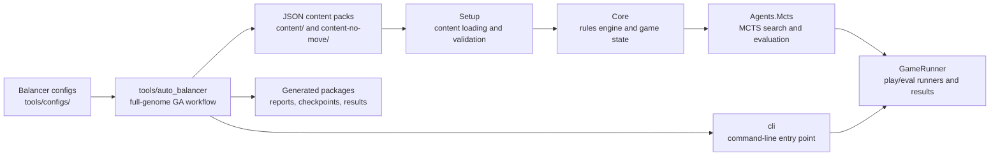
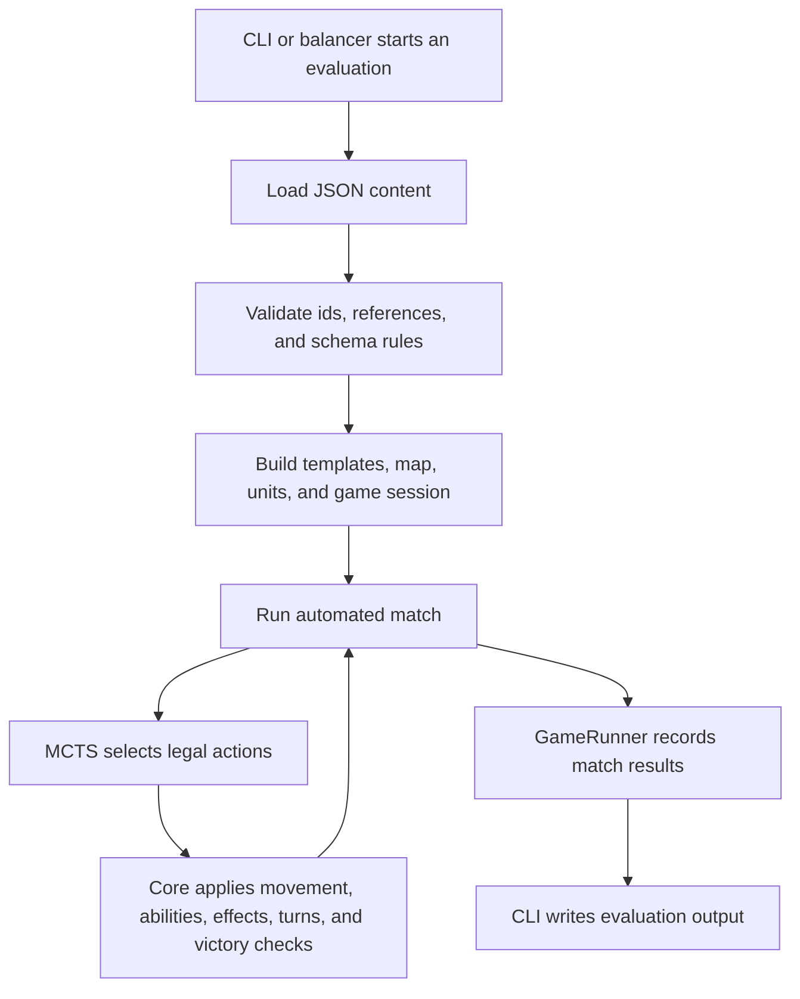
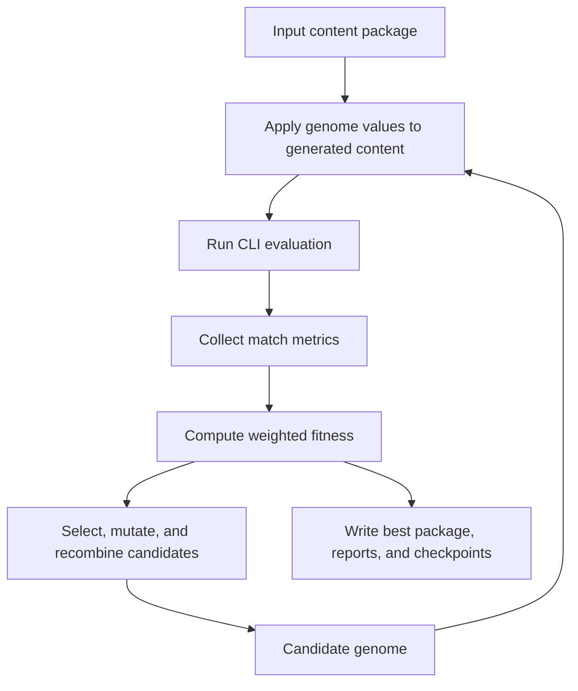

# System Design

This document describes the current system design and records the UML design history kept in `docs/UMLS/`.

The current source of truth is the implemented code and the current documentation in this directory. The UML archive is included as evidence of the design process across development sprints.

## Current Architecture

The project is split into a C# simulation stack and Python balancing tooling.

The C# side owns the game simulation. It loads content, constructs game sessions, applies rules, generates legal actions, runs automated matches, and returns evaluation results. The Python side owns experiment orchestration. It generates candidate content, runs the C# CLI as an evaluator, scores the results, and updates the genetic algorithm population.

## Repository Structure

- `src/` contains the main C# solution code.
  - `Core/` implements the turn-based tactics rules engine, including maps, units, abilities, effects, turn flow, actions, undo support, deterministic randomness, and game state management.
  - `Setup/` loads and validates JSON content, then builds game sessions, maps, unit templates, effect templates, and scenario data.
  - `Agents.Mcts/` contains the Monte Carlo Tree Search agent, state evaluation, hashing, and simulation support used for automated play.
  - `GameRunner/` runs play and evaluation scenarios and collects match results.
  - `cli/` provides the command-line entry point used by the balancing tools to execute simulations.
- `content/` contains the main JSON content pack used by the engine, including unit templates, abilities, effects, effect components, and game states.
- `content-no-move/` contains an alternate content pack variant used for experiments where movement-related behaviour is unused.
- `tools/` contains the Python-based full-genome balancing workflow.
  - `auto_balancer/` contains the main balancing framework, including configuration models, genetic algorithm runners, scenario generation, evaluation workflows, and reporting utilities.
  - `configs/` contains JSON configuration files for full-genome runs, genetic algorithm settings, scenario evaluation, and balance targets.
  - `dependences/` contains vendored Python dependencies used by the tooling.
- `tests/` contains the C# test projects.
  - `Core.Tests/` tests engine rules, map logic, game state behaviour, effects, undo, randomisation, and action handling.
  - `Setup.Tests/` tests content loading, validation, and game/session construction.
  - `Agent.Tests/` tests MCTS-related behaviour, state hashing, evaluation, and supporting simulation logic.
- `docs/` contains additional documentation for the full-genome balancer, content schema, configuration, gameplay rules, MCTS weighting, system design, and UML history.
- `TBT-Engine.sln` is the Visual Studio solution file for building and testing the C# projects.

## Runtime Flow

This flow is deterministic when the same content, scenario setup, configuration, and seeds are used. The balancer relies on that determinism so candidate genomes can be compared through repeatable automated simulations.

## Full-Genome Balancing Flow

The full-genome workflow searches across unit stats, ability costs/ranges where enabled, and numeric effect component values. Structural content such as ids, unit roles, ability lists, targeting type, radius, effect links, and scenario layouts is not changed by the balancer.

The no-move variant keeps movement-related values fixed or unused. It evaluates balance through combat outcomes, role identity, role fairness, match flow, and the shape of the content changes rather than movement behaviour.

## Design History

The `docs/UMLS/` directory stores historical UML and Mermaid design work from earlier development sprints. These files are useful for showing how the project design evolved, but they are not the current architectural reference.

Some content shown in the historical UML diagrams is not present in the final project. This is because parts of the design were removed, replaced, or changed as development progressed. The UMLs were used as planning artefacts throughout the project, so they show the design process rather than an exact final implementation.

The history broadly shows the project moving through these stages:

- Sprint 1 and Sprint 2 explored the early engine, CLI, setup layer, units, effects, and a Unity adapter concept.
- Sprint 3 expanded the rules engine, map, undo layer, setup layer, and runtime effects.
- Sprint 4 and Sprint 5 developed more detailed Core, Setup, CLI, map, engine, game state, effect, ability, and validation diagrams.
- Sprint 6 added more complete Setup, Core, CLI, MCTS, match log, and runtime effect design diagrams.
- Sprint 7 is the closest historical snapshot to the final implemented design, with diagrams for Core, Setup, CLI, MCTS, match logs, maps, effects, game state, and undo.

## Historical UML Archive

The UML archive is organised by sprint. Each sprint archive has a Markdown contents page linking to the individual Mermaid diagram files:

- [Sprint 1 UML archive](UMLS/Sprint%201/README.md)
- [Sprint 2 UML archive](UMLS/Sprint%202/README.md)
- [Sprint 3 UML archive](UMLS/Sprint%203/README.md)
- [Sprint 4 UML archive](UMLS/Sprint%204/README.md)
- [Sprint 5 UML archive](UMLS/Sprint%205/README.md)
- [Sprint 6 UML archive](UMLS/Sprint%206/README.md)
- [Sprint 7 UML archive](UMLS/Sprint%207/README.md)
